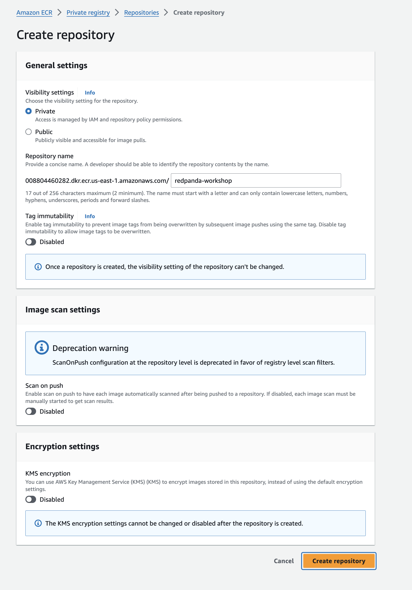
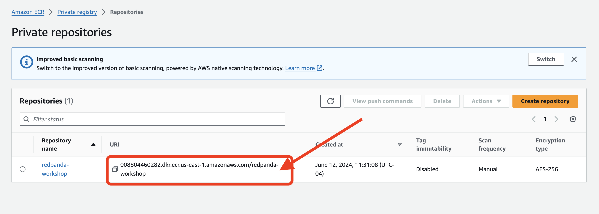
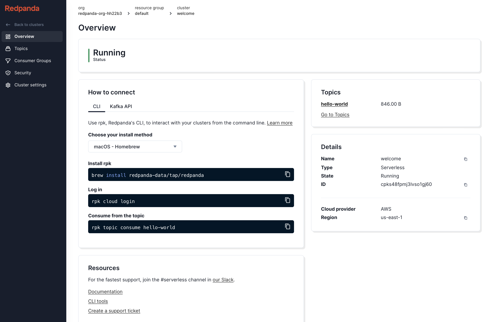
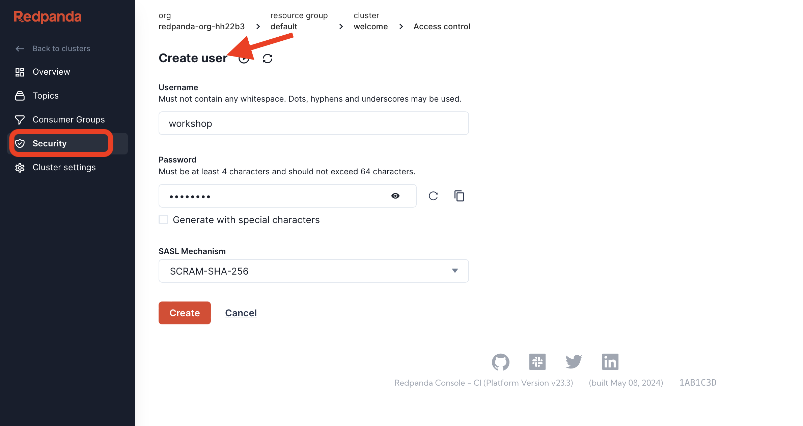
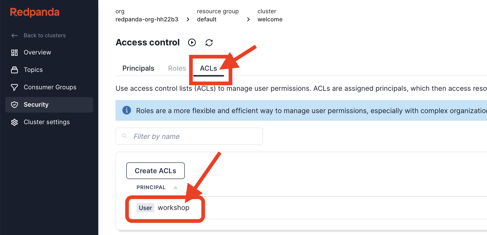
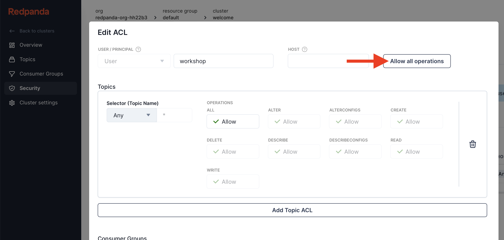
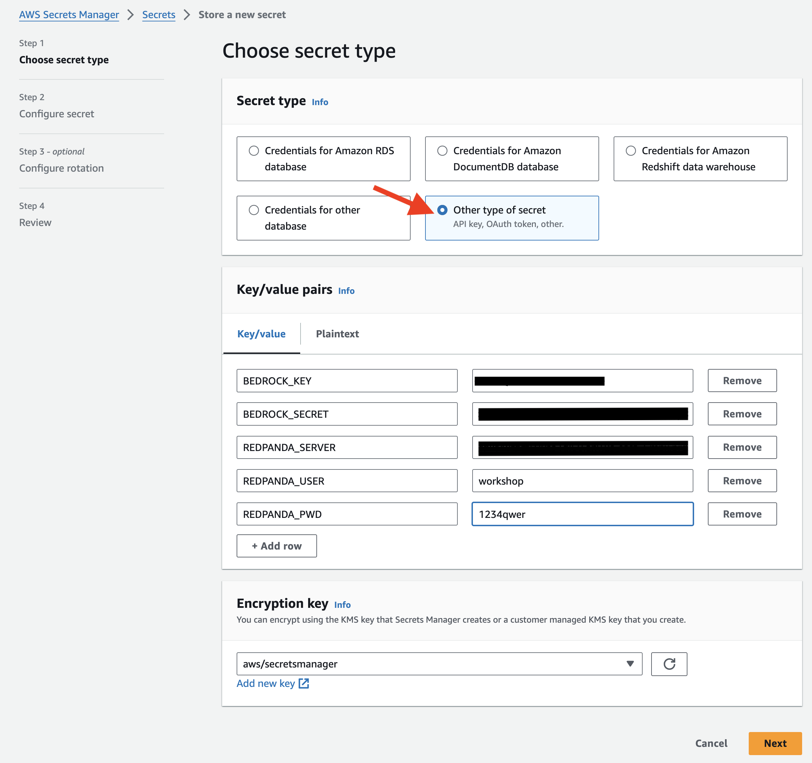
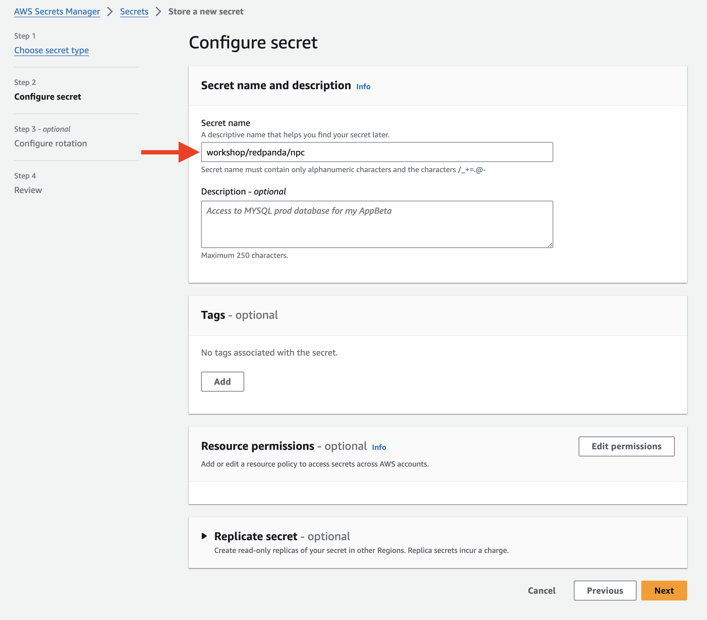
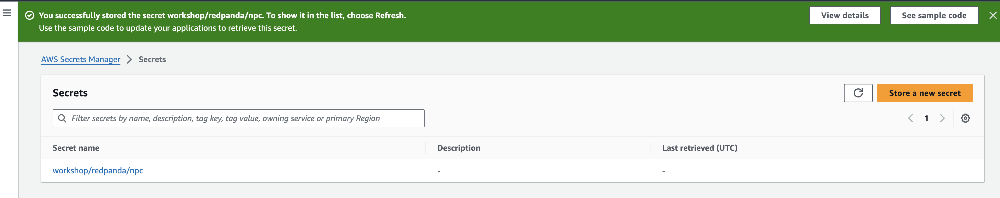

# Enhancing NPCs in Online RPG Games with AI and Serverless Architecture 

## Overview
Traditional RPG games are renowned for their rich and immersive worlds, populated by numerous NPCs (Non-Player Characters) that provide crucial information, hints, and contribute significantly to world-building. However, many current online games fall short in this aspect, with NPCs often reduced to repetitive, robotic dialogues, which can be quite monotonous. To address this, we are going to leverage AI to enhance NPC interactions in our next game, making them more dynamic and engaging.

To prototype this game, we have set the following requirements: the solution needs to be scalable to handle fluctuating traffic typical of online games. It must also scale down resources when they are not needed to optimize cost and efficiency. Therefore, we have decided to adopt a serverless architecture, utilizing streaming for data flow and an Event-Driven Architecture (EDA) as the backbone.

Benefits of Using AI with Serverless Architecture for NPCs:

Scalability and Cost Efficiency:
  - Dynamic Scaling
  - Pay-as-You-Go
Enhanced Player Experience:
  - Intelligent NPCs
  - Continuous Improvement
Efficient Data Handling with Streaming and EDA:
  - Real-time Data Processing
  - Event-Driven Flexibility
  - Modular Design
Seamless Integration and Maintenance:
  - Reliability and Resilience

By leveraging AI and serverless architecture, we can revolutionize NPC interactions in online RPG games, providing a more immersive, responsive, and engaging player experience while maintaining cost efficiency and scalability.

## Technology Stack 
In this workshop, we will leverage a variety of AWS and Redpanda technologies to build and deploy scalable, efficient, and intelligent systems. 

We will use **AWS Lambda** for serverless computing, enabling us to run code in response to events without provisioning or managing servers. For our AI needs, we will utilize **AWS Bedrock** powerful models for natural language processing and chat functionalities. Additionally, we will incorporate LangChain, a framework for developing applications powered by language models, to streamline the integration of advanced AI capabilities into our systems. 

On the Redpanda side, we will leverage **Redpanda Serverless** for scalable and high-throughput data streaming and **Redpanda Connect** (formerly Benthos) for connecting to various data endpoints and enabling seamless data flow integration. 


## Create a New User in IAM
We will walk you through the process of creating a new user in IAM, enabling AWS IAM permissions for Bedrock, signing up for Bedrock.

### Sign in to the AWS Management Console
Open the AWS Management Console at https://aws.amazon.com/ and sign in with your credentials.

### Navigate to the IAM Dashboard
In the AWS Management Console, select Services and then choose IAM under the "Security, Identity, & Compliance" category.

### Add a New User
In the IAM dashboard, click on Users in the left-hand navigation pane.
Click the Add user button at the top of the page.

### Set User Details
User name: Enter a unique username for the new user.
Access type: Select Programmatic access.

### Review and Create User
Review the user details and permissions. Click the Create user button.

### Download Credentials
On the final page, you will see the user’s access key ID and secret access key. Download the credentials file and store it in a secure place. You will need it later.

## Enable AWS IAM Permissions for Bedrock
### Attach Policies to the User
- After creating the user, you need to attach policies that allow access to Bedrock.
- In the IAM dashboard, click on Users and select the newly created user from the list.
- Go to the Permissions tab and click on Add permissions.

### Add Permissions
- Choose Attach policies directly.
- Search for and select the appropriate policies that grant access to Bedrock. These policies include:
    - **AmazonBedrockFullAccess**: This policy grants full access to Bedrock resources.
- Select the policies and click on the Next: Review button.
- Review the permissions and click on the Add permissions button.

### Add Inline Policy 
- To grant OpenSearch Serverless access to your identity, you can:
    - Open the AWS IAM Console.
    - Find your User.
    - Select Add Permissions > Create Inline Policy to attach new inline permissions, open the JSON editor and paste in the below example policy:
    ```
    {
        "Version": "2012-10-17",
        "Statement": [
            {
              "Sid": "Statement1",
              "Effect": "Allow",
              "Action": [
                "aoss:*"
              ],
              "Resource": [
                "*"
              ]
            }
        ]
    }
    ```
### Create Access key

- In Access key 1, click on **Create access key**, select **Application running outside AWS**
- Click Next to proceed and Create access key. 
- STORE THE Access key, and Secret access key, DO NOT LOSE IT!

## Sign up for Bedrock
- Amazon Bedrock is a fully managed service that provides access to foundation models available via an API. With Bedrock, you can choose from a variety of models to find the one that’s best suited for your use case.
- In US-EAST-1, go to https://us-east-1.console.aws.amazon.com/bedrock/home?region=us-east-1#/modelaccess and enable the following model.

## Setup a Container Registry


### Navigate to Amazon ECR
- In the AWS Management Console, select Services.
- Under the "Containers" category, choose Elastic Container Registry.
- In the Amazon ECR dashboard, click on Repositories in the left-hand navigation pane.
- Click the Create repository button at the top of the page.

### Configure the Repository

**Repository name**: `redpanda-workshop`.
**Visibility settings**:  `Private`, The repository is only accessible to your AWS account.



- Review your settings and click the Create repository button.
- Copy the URI and have it handy



## Sign up for Redpanda Serverless Cluster

### Sign up and Create a Cluster
- Redpanda supports Dedicated Cloud, with clusters operating within the Redpanda Cloud environment, as well as Bring Your Own Cloud (BYOC), which allows clusters to run in your private cloud. Redpanda offers developers a third option known as "serverless," providing seamless and immediate access to streaming capabilities.

- For our workshop, we will be using the serverless platform. To start using Redpanda Serverless, [sign up](https://cloud.redpanda.com/sign-up/) for a free trial. Each trial supports five Serverless clusters. 

- Click on the default namespace and enter the welcome cluster


NOTE: You have the ability to create multiple clusters under the namespace, it's great for projects that don’t need a dedicated cluster all the time, spiky workloads and needed separate virtual cluster for topic management.

### Get Redpanda bootstrap URL
- In Overview, under How to connect, click on the `Kafka API`, you'll find the **Bootstrap server URL**, make sure you save it somewhere for later.


### Securing Redpanda
- Configure authentication by going to security and create a new user. 
- Set the username to `workshop`, password to `1234qwer`


- Access-control lists (ACLs) are the primary mechanism used by Redpanda to manage user permissions. On the top tab, click **ACL** and click on the `workshop` principle that you have just created


- Access-control lists (ACLs) are the primary mechanism used by Redpanda to manage user permissions. In the configuration page, chose to grant all permission and click OK to save. 



## Setup Secret Manager

Securely managing sensitive information like the credentials, and encryption keys is crucial. AWS Secret Manager provides a secure and scalable solution for storing and managing secrets. With Secret Manager, you can easily store, retrieve, and rotate secrets, ensuring that your applications have access to the necessary credentials without compromising security.

In this section, we will walk you through the process of setting up Secret Manager and demonstrate how to create and manage secrets. By the end of this tutorial, you will have a solid understanding of how to leverage Secret Manager to enhance the security of your applications.

Let's get started!

### Open the Secrets Manager Console
- Open the Secrets Manager console at https://console.aws.amazon.com/secretsmanager/.

### Create a New Secret
- Choose Store a new secret.
- On the Choose secret type page, do the following:
- For Secret type, choose **Other type of secret**.
- In Key/value pairs,  enter your secret in JSON Key/value pairs and configure the following key/value. And click Next.
    - REDPANDA_SERVER :  Redpanda Bootstrap server URL 
    - REDPANDA_USER : workshop
    - REDPANDA_PWD : 1234qwer
  
- Name the Secret name : workshop/redpanda/npc and go through the steps with default value until you reach step Review, click `store` button to finish setting up the secret.
  
- You'll see the secret created.
  
lm
- Create another new secret called `workshop/redpanda/lambda` for the lambda trigger, repeat above steps with following configuration:
    - username : workshop
    - password : 1234qwer

## Set Up AWS Cloud9 Workspace
Next, create a workspace for the Redpanda workshop, follow these steps:

- navigate to the AWS Cloud9 service.
- Click on the "Create environment" button.
  - Enter a name for your workspace,"redpanda-workshop".
  - Choose "Create a new EC2 instance for environment (direct access)" as the environment type.
  - Select "t3.small" as the instance type.
  - Set the timeout value to 4 hours.
-  Review the configuration and click on the "Create environment" button.
-  Wait for the workspace to be created. Once it's ready, you can access it by clicking on the "Open IDE" button.

Now you have a Cloud9 workspace set up for the Redpanda workshop. You can use this workspace to follow along with the instructions and complete the workshop tasks.


