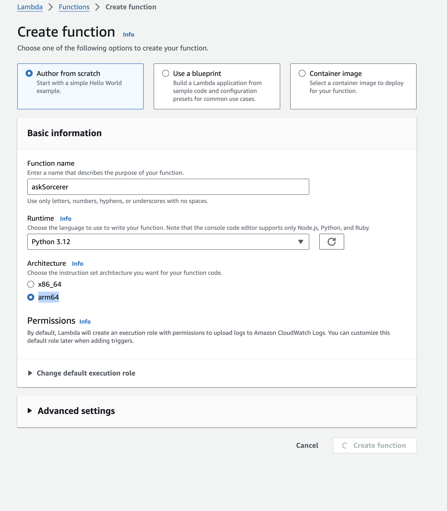

## Create the First Lambda Function 

The Python app is a Lambda function that integrates with Redpanda Serverless. It is responsible for processing messages received from the "npc2-request" topic and generating responses that are published to the "npc-response" topic.

The app starts by importing the necessary libraries, including boto3 for AWS service interactions and KafkaProducer for Kafka messaging. It retrieves the required secrets from AWS Secrets Manager and sets up the Kafka producer.

To deploy the Lambda function, a zip deployment package is created. The required dependencies are listed in the `requirements.txt` file, and a virtual environment is set up to install these dependencies. The installed libraries are then packaged into a zip file along with the `lambda_function.py` file.

The zip file is uploaded to the Lambda function through the AWS Management Console. The function's configuration is updated to include necessary environment variables and permissions. The timeout is set to 30 seconds to ensure the function has enough time to process messages. Test events can be created to verify the function's behavior.

The Lambda function is triggered by messages from the Kafka topic. It receives the event payload, which contains the message from the "npc2-request" topic. 


### Add Topics in Redpanda Serverless Platform  
- Open the Redpanda Serverless platform in your web browser.
- Navigate to the "Topics" section.
- Click on the "Create Topic" button.
- Enter `npc2-request` as the topic name and click "Create".
- Repeat last to create another topic named `npc-response`.
- Verify that both topics have been successfully created.


Now you have added the necessary topics to Redpanda Serverless for your Lambda functions to communicate with.

### Create the Lambda Function
 -  Sign in to the AWS Management Console:
 -  Select Services and then choose Lambda under the "Compute" category.

### Create a New Lambda Function:
- Click the Create function button.
- Select: **Author from scratch**.
- Function name: `askSorcerer`
- Runtime: Choose **Python 3.12**
- Architecture : **arm64**
- Click Create function to create the function.



### Add the Python Code:

- In your workspace, create a new directory `sorcerer` as the working directory for this section
```
cd ~
mkdir environment/sorcerer
cd environment/sorcerer
```

- In the workshop space, create a `lambda_function.py` file:
```
import boto3
import json
import base64 
from kafka import KafkaProducer

# Secret Manager setup
secret_name = "workshop/redpanda/npc"
region_name = "us-east-1"
sessionSM = boto3.session.Session()
client = sessionSM.client(service_name='secretsmanager', region_name=region_name)
get_secret_value_response = client.get_secret_value(SecretId=secret_name)
secret = get_secret_value_response['SecretString']
secret_data = json.loads(secret)
broker = secret_data['REDPANDA_SERVER']
rp_user = secret_data['REDPANDA_USER']
rp_pwd = secret_data['REDPANDA_PWD']

# Kafka Producer setup
producer = KafkaProducer(
    bootstrap_servers=[broker],
    security_protocol="SASL_SSL",
    sasl_mechanism="SCRAM-SHA-256",
    sasl_plain_username=rp_user,
    sasl_plain_password=rp_pwd,
    value_serializer=lambda v: json.dumps(v).encode('utf-8')  # Serializer to convert to JSON
)

# LangChain setup
session = boto3.Session(region_name='us-east-1')
boto3_bedrock = session.client(service_name="bedrock-runtime")

# Set the model ID, e.g., Llama 3 Chat.
model_id = "meta.llama2-13b-chat-v1"


def prepare_prompt(input_query):
    # Embed the message in Llama 3's prompt format.
    prompt = f"""
                Provide an answer in less than 5 sentences. 
                Context: You are a sorcerer who lives in the fantasy world, specialized in light magic, but you are familiar with other elements.
                Context: Your have a hot-cold personality type, normally being sharp but at some prompt suddenly becoming lovestruck. You are in your 20s, and female.

    Question: {input_query}
    """

    # Format the request payload using the model's native structure.
    request = {
        "prompt": prompt
    }

    return json.dumps(request)


def lambda_handler(event, context):
    print(f'event message: {event}')
    for topic_partition, records in event['records'].items():
        for record in records:
            question = base64.b64decode(record['value'])  # Adjust based on actual message format
            print(f"Received message: {prepare_prompt(question)}")

            # Encode and send the request.
            response_stream = boto3_bedrock.invoke_model_with_response_stream(
                body=prepare_prompt(question),
                modelId=model_id,
            )
            response_text = ""

            stream = response_stream.get('body')
            if stream:
                for event in stream:
                    chunk = event.get('chunk')
                    if chunk:
                        chunk_bytes = chunk.get('bytes').decode()
                        generation = json.loads(chunk_bytes).get('generation', '')
                        response_text += generation
            print(f"Response: {response_text}")
            
            message_data = {
                "who": "npc2",
                "msg": response_text.replace("Answer: ", "", 1)
            }
            producer.send('rpg-response', message_data)
            producer.flush()
```
The function retrieves configuration data from AWS Secrets Manager, sets up a Kafka producer to connect to Redpanda with secure credentials, and configures a Bedrock client for model interactions. 

When receiving event, it decodes and formats them into prompts for the Bedrock model, processes the model's response, and sends the combined response back to a Kafka topic. The function ensures secure and efficient message processing, leveraging AWS infrastructure and machine learning capabilities.


### Creating a zip deployment package with dependencies
- Create a `requirements.txt` file with the following content in the same directory:
```
boto3==1.34.128
botocore==1.34.128
jmespath==1.0.1
kafka-python-ng==2.2.2
python-dateutil==2.9.0.post0
s3transfer==0.10.1
six==1.16.0
urllib3==1.26.19
```

- Create and activate a virtual environment in your project directory
```
python3 -m venv env
source env/bin/activate
```

- Install the required libraries with pip. 
```
pip install -r requirements.txt 
```

The folder in which pip installs the libraries may be named site-packages or dist-packages. This folder may be located in either the lib/python3.x or lib64/python3.x directory

- Deactivate the virtual environment
```
deactivate
```

- Navigate into the directory containing the dependencies you installed with pip and create a .zip file in your project directory with the installed dependencies at the root. 

```
cd env/lib/python3.*/site-packages
zip -r ../../../../askSorcerer.zip . -x "*__pycache__*" 
cd ../../../../
zip askSorcerer.zip lambda_function.py
```

- Move the `askSorcerer.zip` to the S3 working bucket **redpanda-working-folder-<YOUR_NAME>**
```
mkdir ~/environment/tempupload
cp askSorcerer.zip ~/environment/tempupload
aws s3 sync  ~/environment/tempupload s3://redpanda-working-folder-<YOUR_NAME>/
```
 

### Upload the Zip File to Lambda Function:

- Back to the AWS Lambda service.
- Select `askSorcerer` Lambda function upload the zip file to.
   

- In the function's configuration, go to the "Code" tab.
- Scroll down to the "Function code" section and click on the "Upload" button.
- Choose the `askSorcerer.zip` file from your S3 **redpanda-working-folder-<YOUR_NAME>** bucket.You can copy the url from the S3 bucket dashboard.
   

- Wait for the upload to complete, and then click on the "Save" button to apply the changes.


###  Update lambda configuration Permissions:

Setting permissions for a Lambda role involves attaching policies that define what actions the Lambda function can perform on AWS resources. 

- In the function's configuration, click on the "Configuration" tab.
- Scroll down to the "Permissions" section, under Execution role section find the Role name, click on the `askSourcerer-role-xxxxxx` to configure the permission.


- Add the necessary following policies
  - **SecretsManagerReadWrite** - allows read/write access to AWS Secrets Manager.
  - **AmazonBedrockFullAccess** - allow access to Bedrock models.
- Click on the "Save" button to apply the changes. 


- Set the timeout for your Lambda function to 30 seconds, still in the "Configuration" tab.
- Scroll down to the "General configuration" section.
- In the "Timeout" field, enter "30" (without quotes) to set the timeout to 30 seconds.
- Click on the "Save" button to apply the changes.

  
This will ensure that your Lambda function has a maximum execution time of 30 seconds before it times out and update the permissions for your Lambda function to include the required access to AWS services and resources.

### Test the Lambda Function
To test the Lambda function with a test event, 

- In the function's configuration, go to the "Test" tab.
- Enter a name for the test event (e.g., "MockEvent").
- In the event body, provide the test event JSON payload 

```
{
  "eventSource": "SelfManagedKafka",
  "bootstrapServers": "redpanda.example.com:9092",
  "records": {
    "npc2-request-0": [
      {
        "topic": "npc2-request",
        "partition": 0,
        "offset": 0,
        "timestamp": 1718237343835,
        "timestampType": "CREATE_TIME",
        "key": "",
        "value": "SG93J3MgeW91ciBkYXk/",
        "headers": []
      }
    ]
  }
}
```
- Click "Test" to execute the Lambda function with the test event


### Configure the Trigger for the Lambda Function
A trigger in AWS Lambda (Kafka) enables the Lambda function to automatically execute in response to new messages published to a specified Kafka topic. By configuring a Kafka trigger, you link a Kafka topic to your Lambda function, ensuring that the function processes each incoming message as it arrives. This setup facilitates real-time data processing and seamless integration between Kafka and Lambda, allowing for efficient event-driven architectures.

To configure the trigger for the Lambda function and connect to the topic in Redpanda Serverless using Kafka endpoint, follow these steps:

- In the function's configuration, go to the "Triggers" tab.
- Click on the "Add trigger" button.
- For the trigger configuration, choose "Kafka".
- Enter the required details:
    - **Bootstrap Server**: Provide the Kafka endpoint of your Redpanda Serverless cluster.
    - **Kafka topic**: Specify the name of the topic you want the Lambda function to subscribe to `npc2-request`.
    - **Batch size**: Set the batch size to 1 to retrieve one record at a time.
    - **Starting position**: Choose where to start reading messages, LATEST to start from the latest message.
    - **Authentication**: Select `SASL_SCRAM_256_AUTH` as the authentication mechanism.
    - **Secrets Manager key**: Enter the key `workshop/redpanda/lambda` for the Secrets Manager secret.

- Click on the "Add" button to attach the trigger to your Lambda function.


This configuration will enable your Lambda function to receive messages from the specified Kafka topic in Redpanda Serverless, with a batch size of 1 record at a time, using SASL/SCRAM authentication and retrieving messages starting from the specified position.

### Test the result
Use the Redpanda Serverless console to post a text message in the "npc2-request" topic. Enter the value `What do you know about the realm?` as the message content.


After the Lambda function is triggered, check the "npc-response" topic to see the result.


### Conclusion
By following these steps, you have successfully created and deployed your first Lambda function that integrates with Redpanda Serverless. This function processes incoming messages from the "npc2-request" topic, generates intelligent responses using AWS Bedrock, and publishes the responses to the "npc-response" topic. 