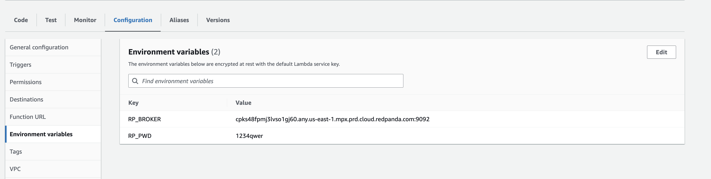
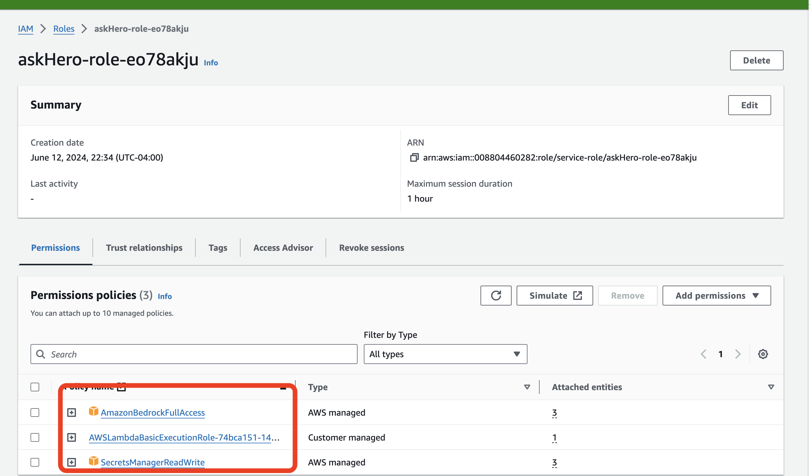

## Data flow in Event Driven Architecture

Event-driven architecture is a powerful approach that enables systems to respond to events and triggers in real-time. In this architecture, data flows through various components, each responsible for handling specific events and performing relevant actions. 

To ensure seamless data integration and routing, a robust data integration pipeline is essential. This pipeline acts as a central hub, receiving incoming data and intelligently rerouting it to the appropriate service based on the event type and the specific model being used. 

By leveraging this data integration pipeline, organizations can efficiently handle different models and services, ensuring that each event is processed by the right component. This approach not only enhances scalability and flexibility but also enables the system to adapt to changing requirements and handle complex event-driven scenarios effectively.

### Add Topics in Redpanda Serverless Platform  
-  Open the Redpanda Serverless platform in your web browser.
- Navigate to the "Topics" section.
- Click on the "Create Topic" button.
- Enter "npc-request" as the topic name and click "Create".
- Verify the topic have been successfully created.

### Upload Redpanda Connect Binary to S3
**Redpanda Connect** is a powerful data integration tool that enables seamless data processing and routing in event-driven architectures. With Redpanda Connect, you can easily handle different models and services, ensuring that each event is processed by the right component.

It is a powerful data integration tool written in Golang. It is designed to handle data processing and routing in event-driven architectures with ease. One of the key advantages of Redpanda Connect is its small footprint, making it an efficient choice for resource-constrained environments.

Being a single binary, Redpanda Connect offers simplicity and ease of deployment. You can quickly set up and configure Redpanda Connect without the need for complex installations or dependencies. This makes it a convenient choice for integrating different components in your event-driven architecture.And you can easily define data processing pipelines using a simple and intuitive configuration file in YAML. It supports various processors and output options, allowing you to customize your data flow according to your specific requirements.

Whether you need to transform, filter, or route data, Benthos provides a flexible and scalable solution. It seamlessly integrates with other components in your architecture, enabling smooth data flow and efficient handling of events.You can enhance the performance and reliability of your event-driven system. Its lightweight nature and efficient design make it an ideal choice for building robust and scalable data integration pipelines.


First, you'll upload the Redpanda binary file to S3
- Download the **Redpanda Connect** single binary from [here](tbd)
- In the AWS Management Console, select Services and then choose S3 under the "Storage" category.
- Click the Create bucket button, with Bucket type: General Purpose
- Enter a name `redpanda-connect` for your bucket,  go ahead with default values and create.
  


- Now, upload the binary, click the Upload button.
- Click Add files and select the `redpanda-connect-lambda-al2_4.27.0_linux_arm64.zip`.
- Click Upload to upload the file to S3.
- Copy the URL for this file in S3.


### Use the ZIP File to Add a Layer to a Lambda Function

- In the Lambda dashboard, click on Layers in the left-hand navigation pane.
  
- Click the Create layer button.
**Name**: `redpanda-connect-binary`.
**Upload**: Under the Code entry type section, select Upload a file from S3.
**S3 Link**: Choose Amazon S3 location and provide the link to the ZIP file you uploaded (The URL that was copied in previous step).
**Runtime**: Select the runtime `Amazon Linux 2` for the layer (e.g., Go 1.x).
- Click the Create button to create the layer.


### Create a New Lambda Function:

- Click the Create function button.
- Select Author from scratch.
- Function name: Enter name `rerouteNPC` for the Lambda function.
- Runtime: Choose Amazon Linux 2. as we need Go runtime.
- Architecture: arm64
- Click Create function to create the function.


### Redpanda Connect in Lambda
- In the Lambda function editor, create a file `benthos.yaml` and :
```
pipeline:
  processors:
    - mapping: |
         root = this.records.values().index(0).index(0).value.decode("base64")
output:
  switch:
    cases:
      - check: this.who == "npc1"
        output:
          kafka_franz:
            seed_brokers:
              - ${RP_BROKER}
            topic: npc1-request
            tls:
              enabled: true
            sasl:
              - mechanism: SCRAM-SHA-256
                username: ${RP_USERNAME:workshop}
                password: ${RP_PWD}
          processors:
            - type: bloblang
              bloblang: |
                root = this.msg
      - check: this.who == "npc2"
        output:
          kafka_franz:
            seed_brokers:
              - ${RP_BROKER}
            topic: npc2-request
            tls:
              enabled: true
            sasl:
              - mechanism: SCRAM-SHA-256
                username: ${RP_USERNAME:workshop}
                password: ${RP_PWD}
          processors:
            - type: bloblang
              bloblang: |
                root = this.msg
  logger:
    level: DEBUG
    format: logfmt
    add_timestamp: false
    level_name: level
    timestamp_name: time
    message_name: msg
    static_fields:
      '@service': benthos

```


### Add Environment Variable to Lambda Function
- In the function's configuration, go to the "Configuration" tab.
- Scroll down to the "Environment variables" section.
- Click on the "Edit" button.
- Add a new environment variable with the following details:
  - Key: RP_BROKER Value: **your Redpanda Serverless Bootstrap URL**
  - Key: RP_USERNAME Value: `workshop`
  - Key: RP_PWD Value: `1234qwer`
- Click on the "Save" button to apply the changes.




### Add the Layer to Your Go Lambda Function

- In the Code tab, scroll down.
- Click the Add a layer button.
- 


- Choose **Custom layers** and select the layer you created .


- In the Code Source tab, if you see the __Changes not deployed__, click **Deploy** to update your function


###  Update lambda configuration Permissions:

- In the function's configuration, click on the "Configuration" tab.
- Scroll down to the "Permissions" section, under Execution role section find the Role name, click on the `askHero-role-xxxxxx` to configure the permission.


- Add the necessary following policies
  - **SecretsManagerReadWrite** - allows read/write access to AWS Secrets Manager.
- Click on the "Save" button to apply the changes. 




### Configure the Trigger for the Lambda Function
To configure the trigger for the Lambda function and connect to the topic in Redpanda Serverless using Kafka endpoint, follow these steps:

- In the function's configuration, go to the "Triggers" tab.
- Click on the "Add trigger" button.
- For the trigger configuration, choose "Kafka".
- Enter the required details:
    - **Bootstrap Server**: Provide the Kafka endpoint of your Redpanda Serverless cluster.
    - **Kafka topic**: Specify the name of the topic you want the Lambda function to subscribe to `npc-request`.
    - **Batch size**: Set the batch size to 1 to retrieve one record at a time.
    - **Starting position**: Choose where to start reading messages, LATEST to start from the latest message.
    - **Authentication**: Select `SASL_SCRAM_256_AUTH` as the authentication mechanism.
    - **Secrets Manager key**: Enter the key **workshop/redpanda/lambda** for the Secrets Manager secret.


### Test the result
- Use the Redpanda Serverless console to post a text message in the "npc-request" topic. Enter the value below as the message content.

```
{
    "who": "npc1",
    "msg": "Where were you yesterday?"
}
```

- Remember to select **JSON** as the value type


After the Lambda function is triggered, check the "npc1-request" topic to see the result.


### Clone the GitHub Repository and Start the Node.js App
To start building the frontend of the prototype game, we will be creating a Node.js application in the workspace. This application will serve as the frontend of the game, providing a user interface for players to interact with. 

- To get started, in cloud9 in terminal or command prompt and navigate to the working directory and clone the frontend application:

```
git clone https://github.com/weimeilin79/aws-redpanda-workshop.git
```

- Navigate to the frontend directory, and load and install the necessary dependencies:
```
cd aws-redpanda-workshop/frontend
npm install
```

- Start the Node.js application:
  
```
export REDPANDA_BROKERS=<your Redpanda Serverless Bootstrap URL>
node index.js
```

With this Node.js application in place, you can now start running the frontend of your prototype game. On the top menu bar, click on Preview > Preview Running Application  


You'll see the RPG running,and go ahead start having conversation with the Hero and Sorcerer NPC.


## Challenge: add another NPC 

Did you see there is another Goddess in the game, can you please help to create the backend AI inference application?
> Hint: she is **npc3**

