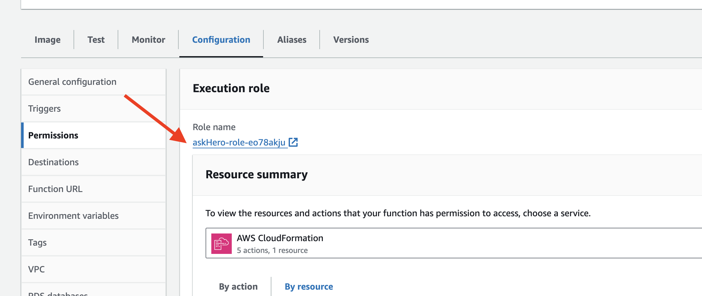
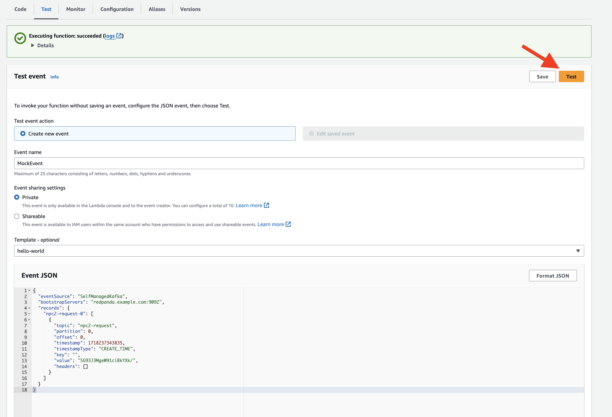

## Create the Second Lambda Function using Docker


### Add Topics in Redpanda Serverless Platform  
-  Open the Redpanda Serverless platform in your web browser.
- Navigate to the "Topics" section.
- Click on the "Create Topic" button.
- Enter "npc1-request" as the topic name and click "Create".
- Verify that thw topics have been successfully created.

### Setup a Container Registry
- In the AWS Management Console, select Services.
- Under the "Containers" category, choose Elastic Container Registry.
- In the Amazon ECR dashboard, click on Repositories in the left-hand navigation pane.
- Click the Create repository button at the top of the page.

### Configure the Repository

**Repository name**: `redpanda-workshop`.
**Visibility settings**:  `Private`, The repository is only accessible to your AWS account.


- Review your settings and click the Create repository button.
- Copy the URI and have it handy


### Building Langchain App

In your workspace, create a new directory hero as the working directory for this section. This directory will be used for building an AI inference app using LangChain for you Hero NPC.
  
```
cd ~
mkdir hero
cd hero
```

- Create a file named `lambda_function.py`:

```
import json
import base64 
import boto3
from kafka import KafkaProducer
from langchain_community.llms import Bedrock
from langchain_aws import BedrockLLM
from langchain_core.prompts import PromptTemplate

# Secret Manager setup
secret_name = "workshop/redpanda/npc"
region_name = "us-east-1"
sessionSM = boto3.session.Session()
client = sessionSM.client(service_name='secretsmanager', region_name=region_name)
get_secret_value_response = client.get_secret_value(SecretId=secret_name)
secret = get_secret_value_response['SecretString']
secret_data = json.loads(secret)
broker = secret_data['REDPANDA_SERVER']
rp_user = secret_data['REDPANDA_USER']
rp_pwd = secret_data['REDPANDA_PWD']

# Kafka Producer setup
producer = KafkaProducer(
    bootstrap_servers=[broker],
    security_protocol="SASL_SSL",
    sasl_mechanism="SCRAM-SHA-256",
    sasl_plain_username=rp_user,
    sasl_plain_password=rp_pwd,
    value_serializer=lambda v: json.dumps(v).encode('utf-8')  # Serializer to convert to JSON
)

# LangChain setup
session = boto3.Session(region_name='us-east-1')
boto3_bedrock = session.client(service_name="bedrock-runtime")

# Langchain LLM
llm = BedrockLLM(client=boto3_bedrock, model_id="meta.llama2-13b-chat-v1", region_name='us-east-1')

def prepare_prompt():
    prompt_template = """
        Context: You are a hero who lives in a fantasy world. You have just defeated a monster and are in high spirits. 
        Instruction: Please answer the following question in less than 5 sentences and in an upbeat tone. Don't provide a note in the answer.
        
        Question: {input_query}
    """


    PROMPT = PromptTemplate(input_variables=["input_query"], template=prompt_template)
    return PROMPT

def lambda_handler(event, context):
    for topic_partition, records in event['records'].items():
        for record in records:
            question = base64.b64decode(record['value'])  
            print(f"Received message: {question}")
            response_msg = query_data(prepare_prompt(),question)
            
            # Convert response_msg to string and print ASCII values for debugging
            response_msg = str(response_msg)
            print(f"Raw response message: {response_msg}")
            print(f"ASCII values: {[ord(c) for c in response_msg[:20]]}")

            # Manually remove "Answer:" including any potential leading/trailing whitespace
            prefix = "Answer:"
            stripped_response = response_msg.strip()
            if stripped_response.startswith(prefix):
                response_msg = stripped_response[len(prefix):].strip()
            
            print(f'Response message after stripping: {response_msg}')


            # Send response back via Kafka
            message_data = {
                "who": "npc1",
                "msg": response_msg
            }
            producer.send('rpg-response', message_data)
            producer.flush()


def query_data(prompt, query):
    chain = prompt | llm
    response_msg = chain.invoke({"input_query": query})
    return response_msg

```

### Package LangChain Application in container

Package the LangChain application in a Docker container to ensure consistent and reliable deployment across different environments. Here it will be used to deploy in Lambda

- Create a file name `Dockerfile` 
  
```
FROM public.ecr.aws/lambda/python:3.12

# Copy requirements.txt
# COPY requirements.txt ${LAMBDA_TASK_ROOT}

# Install the specified packages
RUN pip install langchain_community
RUN pip install langchain
RUN pip install langchain_aws
RUN pip install boto3
RUN pip install botocore
RUN pip install kafka-python-ng

# Copy function code
COPY lambda_function.py ${LAMBDA_TASK_ROOT}

# Set the CMD to your handler (could also be done as a parameter override outside of the Dockerfile)
CMD ["lambda_function.lambda_handler"]

```

### Build and Push the Docker Image to Amazon ECR

- Build the Docker Image:
Open a terminal and navigate to the directory containing your Dockerfile.
Build the Docker image:

```
docker build -t askhero .
```

Tag the Docker Image:
```
docker tag askhero <your-ecr-repository-uri>
```

- Push the Docker Image to ECR:
  
```
aws ecr get-login-password --region us-east-1 | docker login --username AWS --password-stdin <your-ecr-repository-uri>
```

- By running this command, the Docker image built in the previous steps will be pushed to the specified ECR repository, making it available for deployment and use in other services or environments.

```
docker push <your-ecr-repository-uri>
```

### Create the Lambda Function from the Docker Image

- Navigate to Lambda
- Click the Create function button.
- Select Container image.
- Function name: `askhero`


- Container image URI: Enter the URI of your Docker image in ECR.


Click Create function to create the function.
###  Update lambda configuration Permissions:

- In the function's configuration, click on the "Configuration" tab.
- Scroll down to the "Permissions" section, under Execution role section find the Role name, click on the `askHero-role-xxxxxx` to configure the permission.


- Add the necessary following policies
  - **SecretsManagerReadWrite** - allows read/write access to AWS Secrets Manager.
  - **AmazonBedrockFullAccess** - allow access to Bedrock models.
- Click on the "Save" button to apply the changes. 


- Set the timeout for your Lambda function to 30 seconds, still in the "Configuration" tab.
- Scroll down to the "General configuration" section.
- In the "Timeout" field, enter "30" (without quotes) to set the timeout to 30 seconds.
- Click on the "Save" button to apply the changes.

  
This will ensure that your Lambda function has a maximum execution time of 30 seconds before it times out and update the permissions for your Lambda function to include the required access to AWS services and resources.

### Test the Lambda Function
To test the Lambda function with a test event, 

- In the function's configuration, go to the "Test" tab.
- Enter a name for the test event (e.g., "MockEvent").
- In the event body, provide the test event JSON payload 

```
{
  "eventSource": "SelfManagedKafka",
  "bootstrapServers": "redpanda.example.com:9092",
  "records": {
    "npc2-request-0": [
      {
        "topic": "npc1-request",
        "partition": 0,
        "offset": 0,
        "timestamp": 1718237343835,
        "timestampType": "CREATE_TIME",
        "key": "",
        "value": "SG93J3MgeW91ciBkYXk/",
        "headers": []
      }
    ]
  }
}
```
- Click on the "Save" button to save the test event, and click "Test" to execute the Lambda function with the test event


### Configure the Trigger for the Lambda Function
To configure the trigger for the Lambda function and connect to the topic in Redpanda Serverless using Kafka endpoint, follow these steps:

- In the function's configuration, go to the "Triggers" tab.
- Click on the "Add trigger" button.
- For the trigger configuration, choose "Kafka".
- Enter the required details:
    - **Bootstrap Server**: Provide the Kafka endpoint of your Redpanda Serverless cluster.
    - **Kafka topic**: Specify the name of the topic you want the Lambda function to subscribe to `npc1-request`.
    - **Batch size**: Set the batch size to 1 to retrieve one record at a time.
    - **Starting position**: Choose where to start reading messages, LATEST to start from the latest message.
    - **Authentication**: Select `SASL_SCRAM_256_AUTH` as the authentication mechanism.
    - **Secrets Manager key**: Enter the key **workshop/redpanda/lambda** for the Secrets Manager secret.

- Click on the "Add" button to attach the trigger to your Lambda function.


This configuration will enable your Lambda function to receive messages from the specified Kafka topic in Redpanda Serverless, with a batch size of 1 record at a time, using SASL/SCRAM authentication and retrieving messages starting from the specified position.

### Test the result
Use the Redpanda Serverless console to post a text message in the "npc1-request" topic. Enter the value "Have you seen monster before?" as the message content.


After the Lambda function is triggered, check the "npc-response" topic to see the result.

