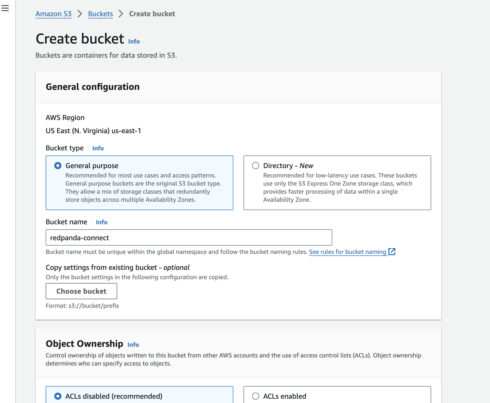
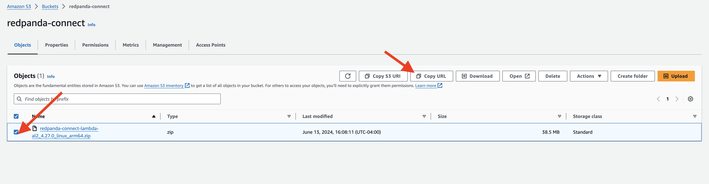
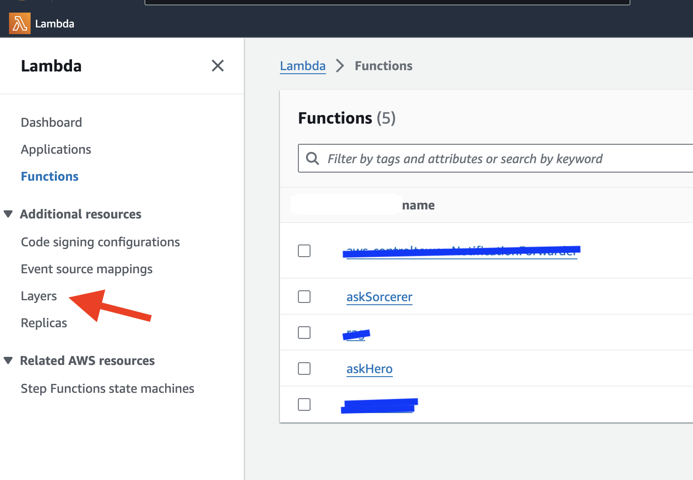
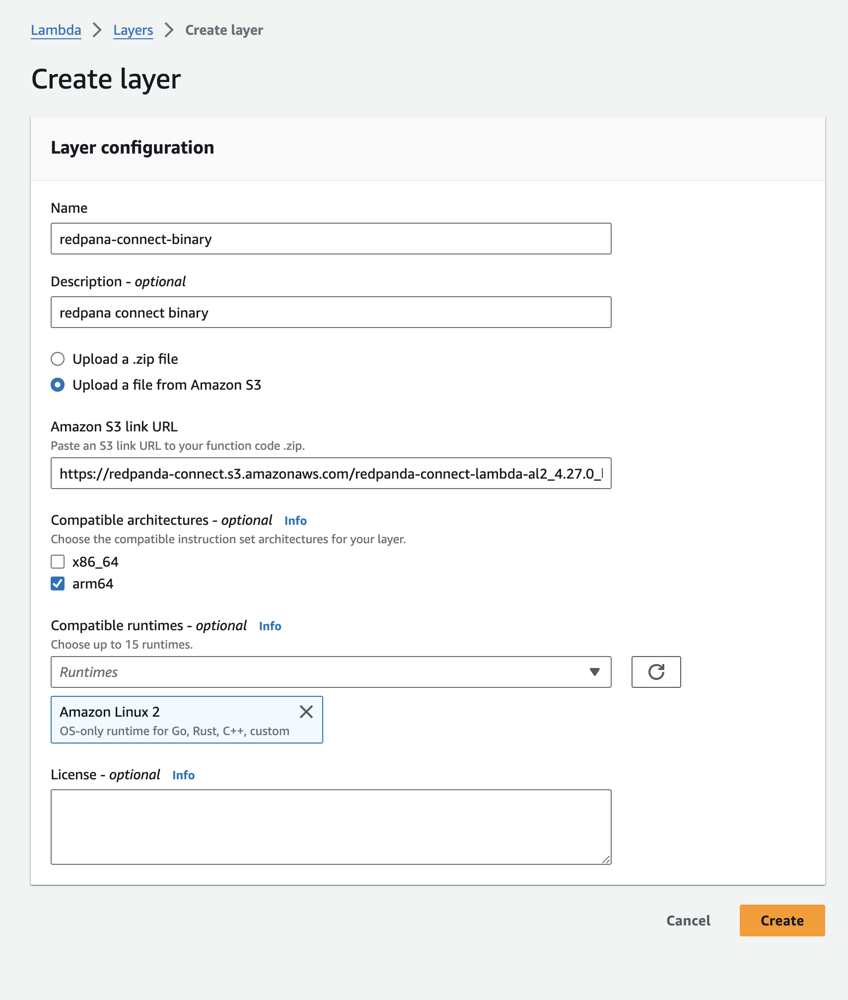

## Integrate with Redpanda Connect with AWS Lambda Using Layers


AWS Lambda Layers provide a way to manage your function dependencies more efficiently, especially when dealing with moderate-sized libraries and binaries. Layers allow you to separate your dependencies from your function code, making it easier to update and manage them independently.

Benefits of Using Lambda Layers:

- Modular Management: Layers enable you to manage your dependencies separately from your function code. This modular approach simplifies updates and maintenance.
- Reduce Deployment Package Size: By offloading the dependencies to a layer, you can keep your deployment package small, focusing on your function code.
- Reuse Across Functions: A single layer can be used by multiple Lambda functions, promoting reusability and consistency across your applications.
- Ease of Updates: Updating a layer does not require redeploying your entire function, thus minimizing deployment times and potential disruptions.

### Add Topics in Redpanda Serverless Platform  
-  Open the Redpanda Serverless platform in your web browser.
- Navigate to the "Topics" section.
- Click on the "Create Topic" button.
- Enter `npc-request` as the topic name and click "Create".
- Verify the topic have been successfully created.

### Upload Redpanda Connect Binary to S3
**Redpanda Connect** is a powerful data integration tool that enables seamless data processing and routing in event-driven architectures. With Redpanda Connect, you can easily handle different models and services, ensuring that each event is processed by the right component.

It is a powerful data integration tool written in Golang. It is designed to handle data processing and routing in event-driven architectures with ease. One of the key advantages of Redpanda Connect is its small footprint, making it an efficient choice for resource-constrained environments.

Being a single binary, Redpanda Connect offers simplicity and ease of deployment. You can quickly set up and configure Redpanda Connect without the need for complex installations or dependencies. This makes it a convenient choice for integrating different components in your event-driven architecture.And you can easily define data processing pipelines using a simple and intuitive configuration file in YAML. It supports various processors and output options, allowing you to customize your data flow according to your specific requirements.

Whether you need to transform, filter, or route data, Benthos provides a flexible and scalable solution. It seamlessly integrates with other components in your architecture, enabling smooth data flow and efficient handling of events.You can enhance the performance and reliability of your event-driven system. Its lightweight nature and efficient design make it an ideal choice for building robust and scalable data integration pipelines.


First, you'll upload the Redpanda binary file to S3:
- Download the **Redpanda Connect** single binary from [here](tbd)
- In the AWS Management Console, select Services and then choose S3 under the "Storage" category.
- Click the Create bucket button, with Bucket type: General Purpose
- Enter a name `redpanda-connect-<YOUR_NAME>` for your bucket,  go ahead with default values and create.
  


- Now, upload the binary, click the Upload button.
- Click Add files and select the `redpanda-connect-lambda-al2_4.27.0_linux_arm64.zip`.
- Click Upload to upload the file to S3.
- Copy the URL for this file in S3.



### Use the ZIP File to Add a Layer to a Lambda Function

- In the Lambda dashboard, click on Layers in the left-hand navigation pane.
  
- Click the Create layer button.
**Name**: `redpanda-connect-binary`.
**Upload**: Under the Code entry type section, select Upload a file from S3.
**S3 Link**: Choose Amazon S3 location and provide the link to the ZIP file you uploaded (The URL that was copied in previous step in bucket "redpanda-connect-<YOUR_NAME>").
**Runtime**: Select the runtime `Amazon Linux 2` for the layer (e.g., Go 1.x).
- Click the Create button to create the layer.


### Create a New Lambda Function:

- Click the Create function button.
- Select Author from scratch.
- Function name: Enter name `rerouteNPC` for the Lambda function.
- Runtime: Choose **Amazon Linux 2**. as we need Go runtime.
- Architecture: arm64
- Click Create function to create the function.


### Redpanda Connect in Lambda
- In the Lambda function editor, create a file `benthos.yaml` and :
```
pipeline:
  processors:
    - mapping: |
         root = this.records.values().index(0).index(0).value.decode("base64")
output:
  switch:
    cases:
      - check: this.who == "npc1"
        output:
          kafka_franz:
            seed_brokers:
              - ${RP_BROKER}
            topic: npc1-request
            tls:
              enabled: true
            sasl:
              - mechanism: SCRAM-SHA-256
                username: ${RP_USERNAME:workshop}
                password: ${RP_PWD}
          processors:
            - type: bloblang
              bloblang: |
                root = this.msg
      - check: this.who == "npc2"
        output:
          kafka_franz:
            seed_brokers:
              - ${RP_BROKER}
            topic: npc2-request
            tls:
              enabled: true
            sasl:
              - mechanism: SCRAM-SHA-256
                username: ${RP_USERNAME:workshop}
                password: ${RP_PWD}
          processors:
            - type: bloblang
              bloblang: |
                root = this.msg
  logger:
    level: DEBUG
    format: logfmt
    add_timestamp: false
    level_name: level
    timestamp_name: time
    message_name: msg
    static_fields:
      '@service': benthos

```


This configuration file is designed for Redpanda Connect, specifically using a data processing pipeline to route and process messages in an event-driven architecture. Here’s a detailed explanation of each section of the configuration:
- processors with mapping that decodes the base64-encoded value from the input record and assigns it to the root of the document for further processing.
- The output defines where and how to send the processed data base on who the NPC is. 

### Add Environment Variable to Lambda Function
- In the function's configuration, go to the "Configuration" tab.
- Scroll down to the "Environment variables" section.
- Click on the "Edit" button.
- Add a new environment variable with the following details:
  - Key: RP_BROKER Value: **your Redpanda Serverless Bootstrap URL**
  - Key: RP_USERNAME Value: `workshop`
  - Key: RP_PWD Value: `1234qwer`
- Click on the "Save" button to apply the changes.


### Add the Layer to Your Go Lambda Function

- In the Code tab, scroll down.
- Click the Add a layer button.
- 


- Choose **Custom layers** and select the layer you created .


- In the Code Source tab, if you see the __Changes not deployed__, click **Deploy** to update your function


###  Update lambda configuration Permissions:

- In the function's configuration, click on the "Configuration" tab.
- Scroll down to the "Permissions" section, under Execution role section find the Role name, click on the `askHero-role-xxxxxx` to configure the permission.


- Add the necessary following policies
  - **SecretsManagerReadWrite** - allows read/write access to AWS Secrets Manager.
- Click on the "Save" button to apply the changes. 


### Configure the Trigger for the Lambda Function
To configure the trigger for the Lambda function and connect to the topic in Redpanda Serverless using Kafka endpoint, follow these steps:

- In the function's configuration, go to the "Triggers" tab.
- Click on the "Add trigger" button.
- For the trigger configuration, choose "Kafka".
- Enter the required details:
    - **Bootstrap Server**: Provide the Kafka endpoint of your Redpanda Serverless cluster.
    - **Kafka topic**: Specify the name of the topic you want the Lambda function to subscribe to `npc-request`.
    - **Batch size**: Set the batch size to 1 to retrieve one record at a time.
    - **Starting position**: Choose where to start reading messages, LATEST to start from the latest message.
    - **Authentication**: Select `SASL_SCRAM_256_AUTH` as the authentication mechanism.
    - **Secrets Manager key**: Enter the key **workshop/redpanda/lambda** for the Secrets Manager secret.


### Test the result
- Use the Redpanda Serverless console to post a text message in the "npc-request" topic. Enter the value below as the message content.

```
{
    "who": "npc1",
    "msg": "Where were you yesterday?"
}
```

- Remember to select **JSON** as the value type


After the Lambda function is triggered, check the "npc1-request" topic to see the result.


### Conclusion

By following the steps outlined above, you have successfully integrated Redpanda Connect with AWS Lambda using layers, creating a robust and efficient event-driven architecture. This setup allows for modular management of your Lambda function dependencies, reducing deployment package size and enabling reusability across multiple functions.

This integration demonstrates the power and flexibility of using Redpanda Connect for seamless data processing and routing, leveraging AWS Lambda for scalable and serverless compute capabilities. With this configuration, the system is well-equipped to handle complex event-driven scenarios, ensuring efficient data flow and real-time processing.