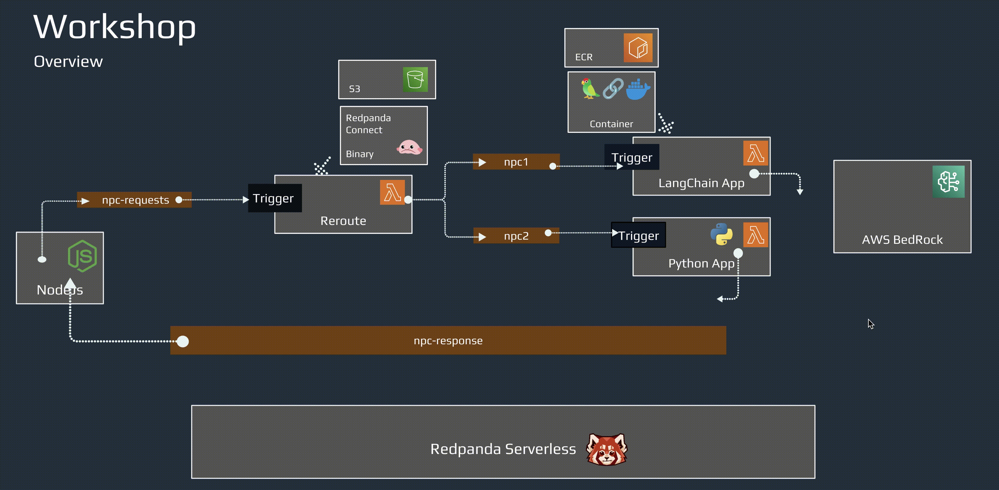
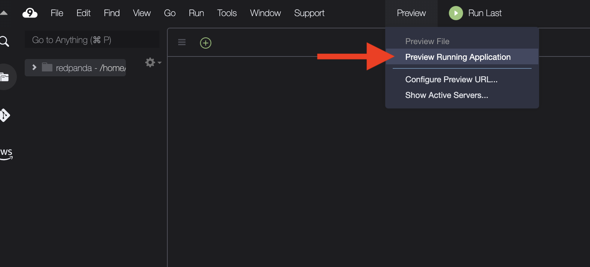
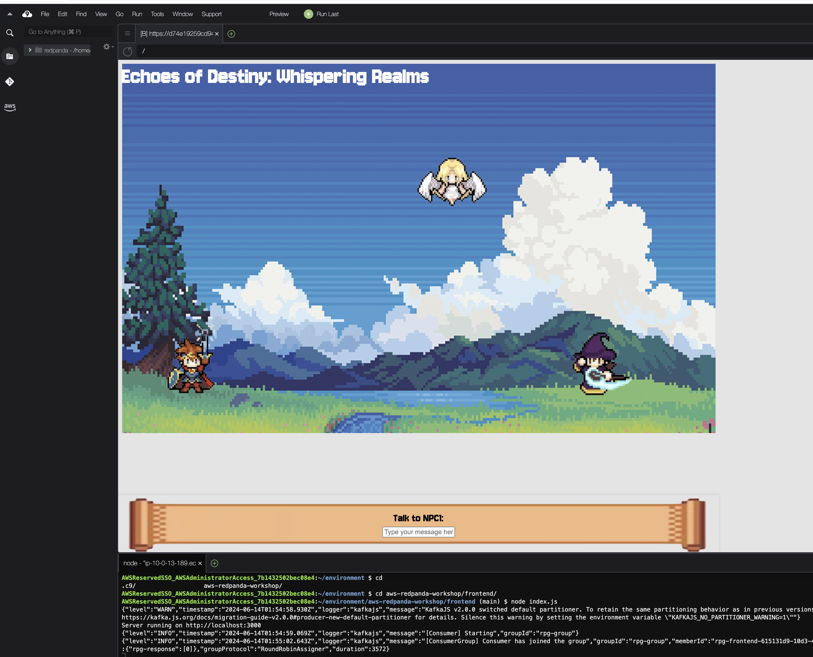

##  Running the RPG Game Frontend


The Node.js frontend of the prototype game serves as the user interface for players to interact with. It is responsible for rendering the game elements and facilitating player actions. 



By cloning the GitHub repository and starting the Node.js app, you can begin building and running the frontend of your game. Follow the steps below to get started:

## Clone the Frontend Application:

- In Cloud9 terminal or your command prompt, navigate to the working directory and clone the frontend application:

```
cd ~/environment
git clone https://github.com/weimeilin79/aws-redpanda-workshop.git
```

The frontend application sets up a web server using Express and integrates with Redpanda Kafka for real-time messaging via Socket.IO. It connects to Kafka brokers, subscribing to the rpg-response and bonus topics. When messages are received from these topics, they are parsed and emitted to connected clients through Socket.IO. The server also listens for messages from user input, which are then sent to the npc-request Kafka topic by the producer.


## Install Necessary Dependencies:
- Navigate to the frontend directory, and load and install the necessary dependencies:
```
cd aws-redpanda-workshop/frontend
npm install
```

The client-side code in app.js uses Socket.IO to enable real-time interactions with the RPG game server. It sets up event listeners for user input, specifically the Enter key, to send messages to the server when a user interacts with an NPC. When the server sends messages back, they are displayed in a typewriter effect within the corresponding NPC's dialog box. Additionally, the script handles special "bonus" messages from the server, displaying them temporarily in a designated area with a blinking effect for enhanced visual feedback. This setup provides a dynamic and interactive user experience, facilitating real-time communication between the client and the server.

## Start the Node.js Application:
  
```
export REDPANDA_BROKERS=<your Redpanda Serverless Bootstrap URL>
node index.js
```

## Game on!
With this Node.js application in place, you can now start running the frontend of your prototype game. On the top menu bar, click on Preview > Preview Running Application.



You'll see the RPG running. Go ahead and start having conversations with the Hero and Sorcerer NPCs.



## Challenge: add another NPC 

Did you see there is another Goddess in the game, can you please help to create the backend AI inference application?

> Hint: she is **npc3**


### Conclusion

By following these steps, you have successfully set up and run the frontend of your prototype game using Node.js and integrated it with Redpanda Kafka for real-time messaging. This configuration provides a dynamic and interactive user experience, facilitating seamless communication between the client and the server. You are now equipped to expand your game further, such as by adding new NPCs like the Goddess, enhancing the depth and engagement of your game.

