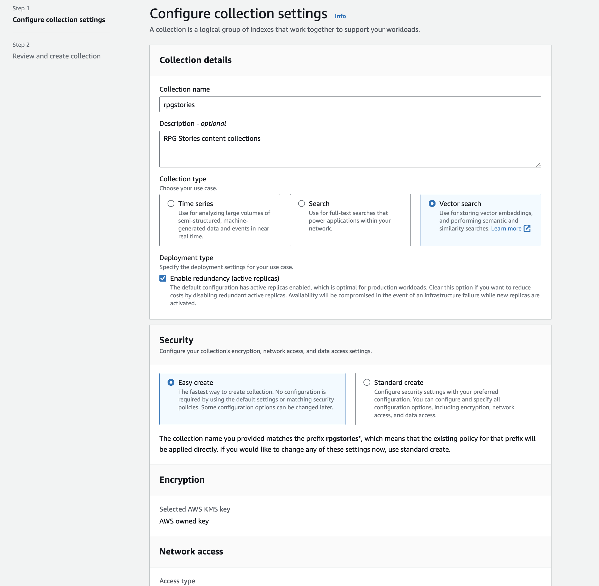
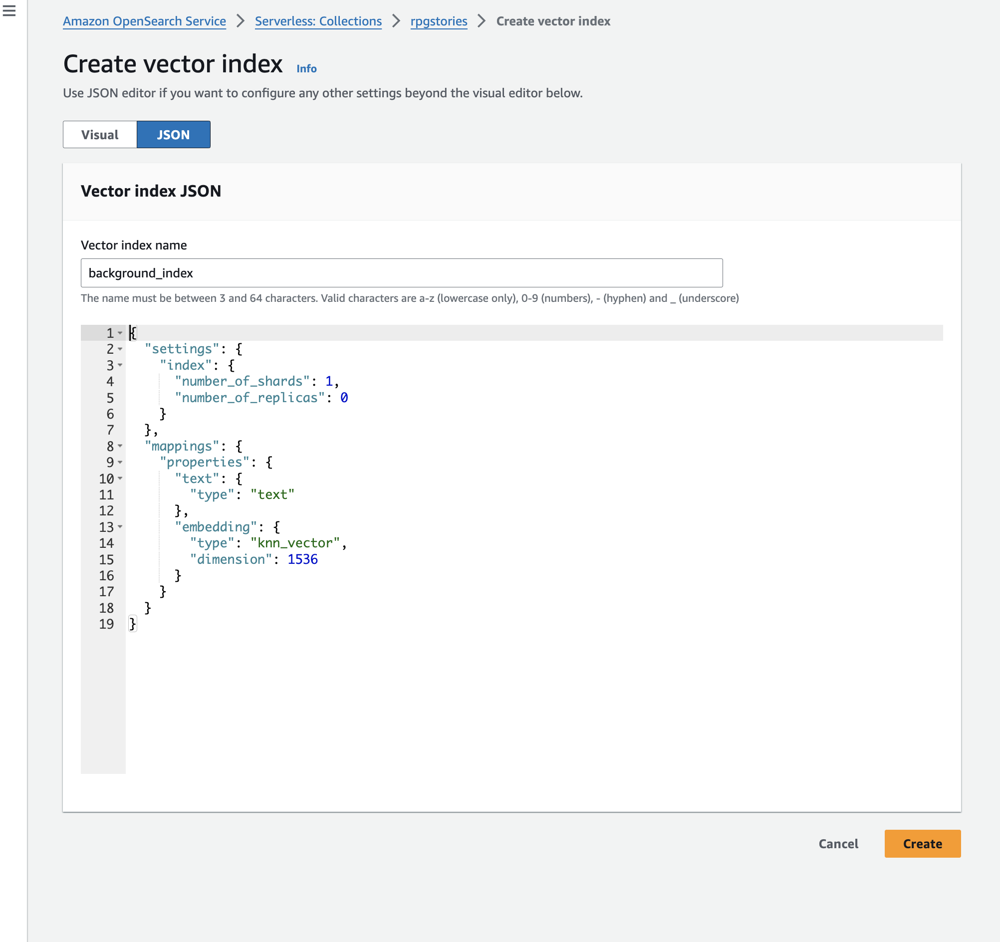
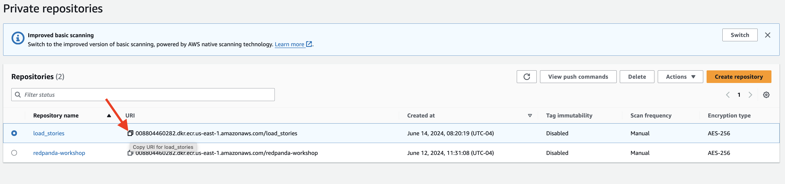
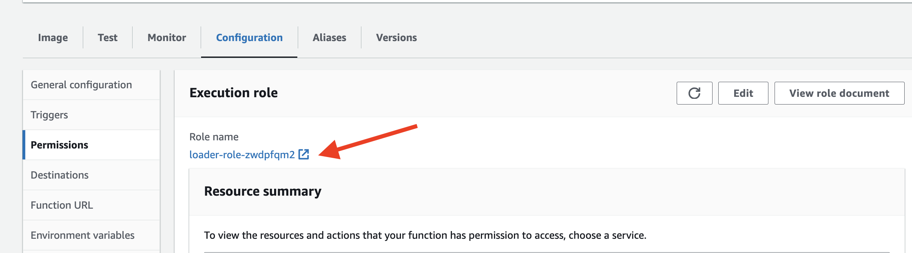
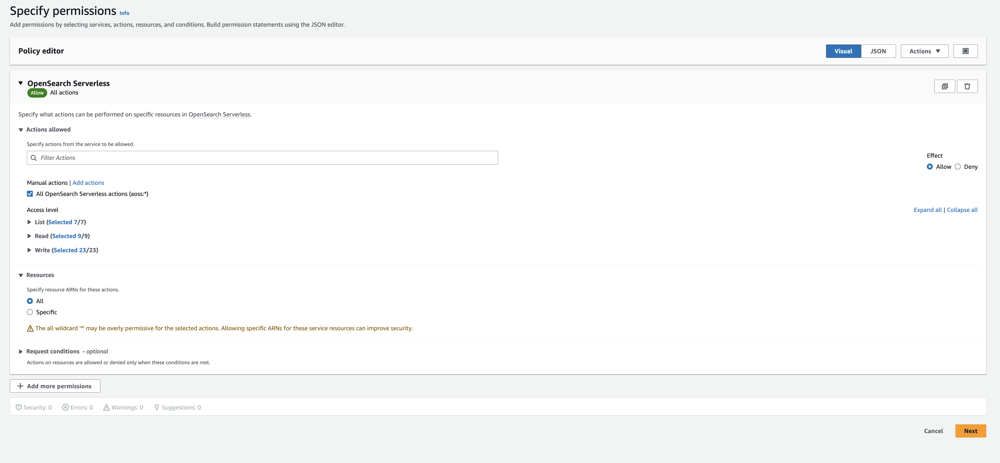
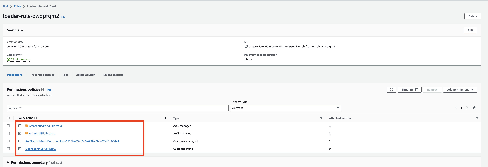

## Load Documents into Vector Data store
TODO: use ENV Variable instead


### Setup S3 bucket to upload story documents

- Open the Amazon S3 console at https://console.aws.amazon.com/s3/.
- Click on the "Create bucket" button.
- Click the Create bucket button, with Bucket type: General Purpose
- Enter a name `redpanda-connect` for your bucket, go ahead with default values and create.
Once the bucket is created, you can use it to upload the story documents.

### Create a Collection in OpenSearch Serverless

- Navigate to Amazon OpenSearch Service console at https://console.aws.amazon.com/opensearch-service/.
- Select **Serverless** and click Get Started.
- In the Serverless dashboard, click on **create collections** button.

- On the "Create collection" page, provide the following details, and submit.
    - Collection name: Enter name `rpgstories` for your collection.
    - Collection type: Select **Vector search**
    - Security : Choose **Easy create**


Click on the "Create collection" button to create the collection.

### Add Index to the Collection

- On the collection details page, click on the Indexes tab.
- Click on the **Create vector index** button.
- Select the **JSON** tab
- Enter `background_index` as the Vector index name
- Create index with following setting and 

```
{
  "settings": {
    "index": {
      "number_of_shards": 1,
      "number_of_replicas": 0
    }
  },
  "mappings": {
    "properties": {
      "text": {
        "type": "text"
      },
      "embedding": {
        "type": "knn_vector",
        "dimension": 1536
      }
    }
  }
}
```


Once the collection and index is created, you can start adding documents to it and perform various operations like searching, filtering, and aggregating data.


### Setup a Container Registry
- In the AWS Management Console, select Services.
- Under the "Containers" category, choose Elastic Container Registry.
- In the Amazon ECR dashboard, click on Repositories in the left-hand navigation pane.
- Click the Create repository button at the top of the page.

### Configure the Repository

**Repository name**: `load_stories`.
**Visibility settings**:  `Private`, The repository is only accessible to your AWS account.

- Review your settings and click the Create repository button.
- Copy the URI and have it handy 




### Building the document loader application

In your workspace, create a new directory `loader` as the working directory for this section. This directory will be used for building an AI inference app using LangChain for you Hero NPC.
  
```
cd ~
mkdir loader
cd loader
```

- Create a file named `lambda_function.py`:

```
import boto3
import json
from opensearchpy import OpenSearch, RequestsHttpConnection, AWSV4SignerAuth
from langchain_community.embeddings import BedrockEmbeddings
from opensearchpy.helpers import bulk, BulkIndexError

# OpenSearch configuration
host = '<YOUR_OPENSEARCH_URL>'
region = 'us-east-1'
service = 'aoss'
index_name = 'backgorund_index'

# Initialize Boto3 session
session = boto3.Session()

# Initialize OpenSearch client
credentials = session.get_credentials()
auth = AWSV4SignerAuth(credentials, region, service)
client = OpenSearch(
    hosts=[{'host': host, 'port': 443}],
    http_auth=auth,
    use_ssl=True,
    verify_certs=True,
    connection_class=RequestsHttpConnection
)
 # Initialize S3 client
s3 = boto3.client('s3')
bedrock = session.client(service_name="bedrock-runtime")

# Initialize the BedrockEmbeddings model
embeddings_model = BedrockEmbeddings(model_id="amazon.titan-embed-text-v1", client=bedrock)

def lambda_handler(event, context):
   
    # Get the S3 bucket and object keys from the event
    bucket = event['Records'][0]['s3']['bucket']['name']
    keys = [record['s3']['object']['key'] for record in event['Records']]
    
    # List to store documents for bulk indexing
    docs_to_index = []
    
    # Process each document
    for key in keys:
        print(f"Processing document: {key}")
        # Read the document from S3
        obj = s3.get_object(Bucket=bucket, Key=key)
        document_content = obj['Body'].read().decode('utf-8')

        # Create a document object
        documents = [document_content]
        texts = [doc for doc in documents]

        # Generate embeddings for the document
        embeddings = embeddings_model.embed_documents(texts)

        # Prepare documents for indexing
        for i, (doc, embedding) in enumerate(zip(documents, embeddings)):
            doc_body = {
                'text': doc,
                'embedding': embedding
            }
            # Add the document to the bulk request
            docs_to_index.append({
                '_op_type': 'index',
                '_index': index_name,
                '_source': doc_body
            })
    
    # Bulk insert documents and handle errors
    try:
        bulk(client, docs_to_index)
        print("Documents indexed successfully.")
    except BulkIndexError as e:
        print(f"Bulk indexing error: {e}")
        for error in e.errors:
            print(error)

    return {
        'statusCode': 200,
        'body': json.dumps('Documents indexed successfully')
    }
```
- Make sure you replace <YOUR_OPENSEARCH_URL> with your OpenSearch Serverless endpoint

### Package Loader Application in container

Package the LangChain application in a Docker container to ensure consistent and reliable deployment across different environments. Here it will be used to deploy in Lambda

- Create a file name `Dockerfile` 
  
```
FROM public.ecr.aws/lambda/python:3.12

# Copy requirements.txt

# Install the specified packages
RUN pip install langchain_community
RUN pip install langchain
RUN pip install boto3
RUN pip install botocore
RUN pip install opensearch-py

# Copy function code
COPY lambda_function.py ${LAMBDA_TASK_ROOT}

# Set the CMD to your handler (could also be done as a parameter override outside of the Dockerfile)
CMD ["lambda_function.lambda_handler"]
```


### Build and Push the Docker Image to Amazon ECR
- Build the Docker Image:
Open a terminal and navigate to the directory containing your Dockerfile.
Build the Docker image:

```
docker build -t load_stories .
```

Tag the Docker Image:
```
docker tag load_stories <your-ecr-repository-uri>
```

- Push the Docker Image to ECR:
  
```
aws ecr get-login-password --region us-east-1 | docker login --username AWS --password-stdin <your-ecr-repository-uri>
```

- By running this command, the Docker image built in the previous steps will be pushed to the specified ECR repository, making it available for deployment and use in other services or environments.

```
docker push <your-ecr-repository-uri>
```

### Create the Lambda Function from the Docker Image

- Navigate to Lambda
- Click the Create function button.
- Select Container image.
- Function name: `loader`
- Container image URI: Enter the URI of your Docker image in ECR.


Click Create function to create the function.
###  Update lambda configuration Permissions:

- In the function's configuration, click on the "Configuration" tab.
- Scroll down to the "Permissions" section, under Execution role section find the Role name, click on the `loader-role-xxxxxx` to configure the permission.


- Add the necessary following policies
  - **AmazonS3FullAccess** - allows read/write access to S3 buckets.
  - **AmazonBedrockFullAccess** - allow access to Bedrock models.
- Add the Opensearch Serverless permission, under **Add permission**, choose inline policies

- Grant all action by selecting **All OpernSearch Serverless actions (aoss.*)**
- Assign all collection in the account


- Name the Policy Name to `OpenSearchServerlessAll`
- Click on the "Create Policy" button to apply the changes. 
 



- Set the timeout for your Lambda function to 30 seconds, still in the "Configuration" tab.
- Scroll down to the "General configuration" section.
- In the "Timeout" field, enter "30" (without quotes) to set the timeout to 30 seconds.
- Click on the "Save" button to apply the changes.
  
This will ensure that your Lambda function has a maximum execution time of 30 seconds before it times out and update the permissions for your Lambda function to include the required access to AWS services and resources.

### Configure the Trigger for the Lambda Function
To configure the trigger for the Lambda function and listens to any uploaded documents into the S3 bucket, follow these steps:

- In the function's configuration, go to the "Triggers" tab.
- Click on the "Add trigger" button.
- For the trigger configuration, choose "S3".
- Enter the required details:
    - **Bucket**: Choose the `S3/redpanda-workshop` bucket.
    - Check the acknowledgement box

- Click on the "Add" button to attach the trigger to your Lambda function.


### Load Story Documents
To load the story documents into the S3 bucket, follow these steps:

- Download the documents from the GitHub repository:
    - In your laptop.
    - Navigate to the directory where you want to download the documents.
    - Run the following command to download the documents or manually download all files in the stories folder:
      ```
      git clone http://github.com/weimeilin79/xxxx/foldery
      ```

- Upload the downloaded documents to the S3 bucket:
    - Open the AWS Management Console.
    - Go to the S3 service.
    - Select the `redpanda-connect` bucket.
    - Click on the "Upload" button.
    - Choose the downloaded documents from your local machine.
    - Click on the "Upload" button to upload the documents to the S3 bucket.

Once the documents are uploaded to the S3 bucket, you can proceed with further steps in your workflow.

- Optional, in the OpenSearch Dashboard, under DevTool, check the number of document in the collection


```
GET backgorund_index/_count
```

### Update LangChain app with RAG by loading documents

### Update the bedrock one 


### deploy again, and run test


