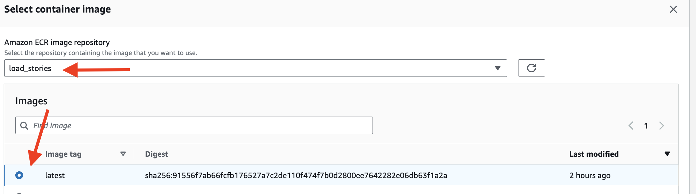
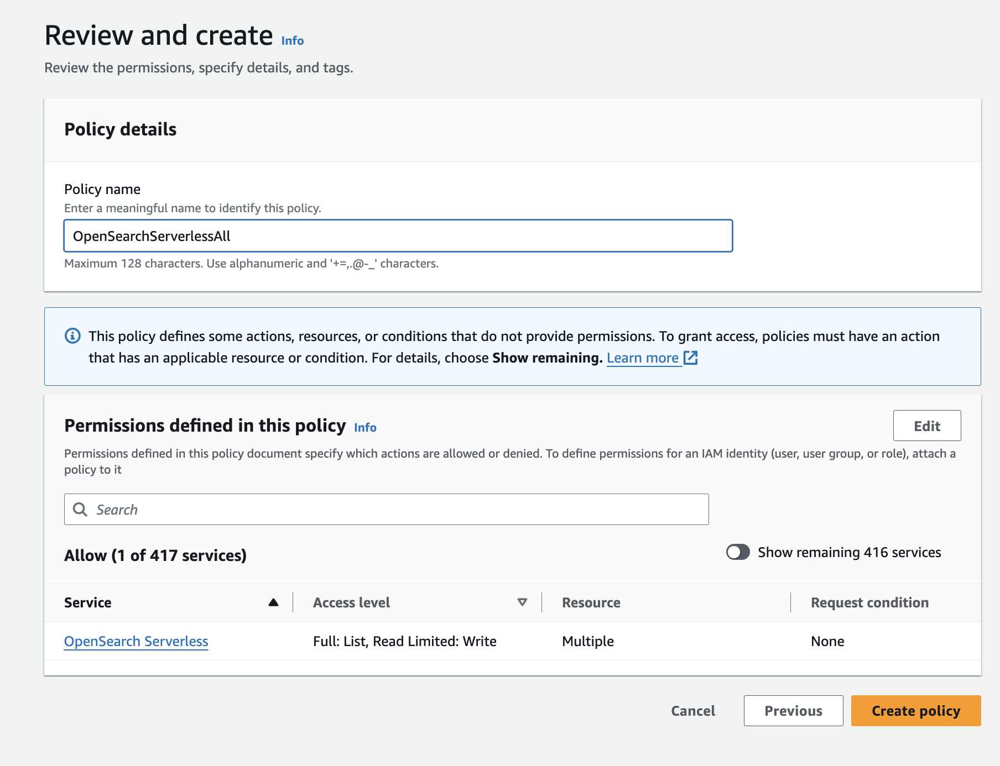
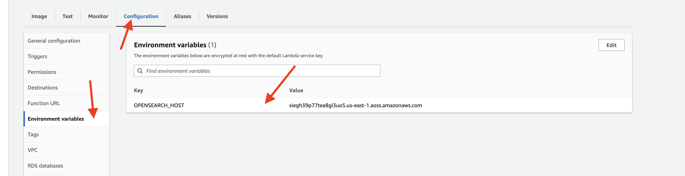
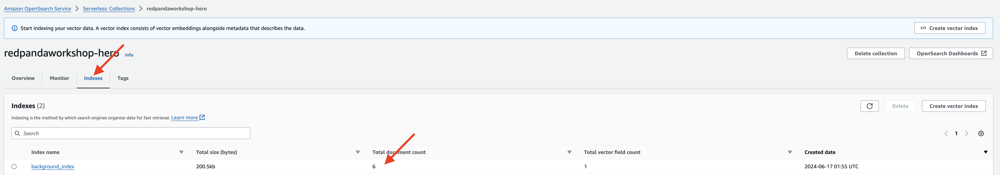

## Load Documents into Vector Data store
TODO: use ENV Variable instead


### Setup S3 bucket to upload story documents

- Open the Amazon S3 console at https://console.aws.amazon.com/s3/.
- Click on the "Create bucket" button.
- Click the Create bucket button, with Bucket type: General Purpose
- Enter a name `redpanda-connect` for your bucket, go ahead with default values and create.
Once the bucket is created, you can use it to upload the story documents.

### Create a Collection in OpenSearch Serverless

- Navigate to Amazon OpenSearch Service console at https://console.aws.amazon.com/opensearch-service/.
- Select **Serverless** and click Get Started.
- In the Serverless dashboard, click on **create collections** button.

- On the "Create collection" page, provide the following details, and submit.
    - Collection name: Enter name `rpgstories` for your collection.
    - Collection type: Select **Vector search**
    - Security : Choose **Easy create**


Click on the "Create collection" button to create the collection.

### Add Index to the Collection

- On the collection details page, click on the Indexes tab.
- Click on the **Create vector index** button.
- Select the **JSON** tab
- Enter `background_index` as the Vector index name
- Create index with following setting and 

```
{
  "settings": {
    "index": {
      "number_of_shards": 1,
      "number_of_replicas": 0,
      "knn": true
    }
  },
  "mappings": {
    "properties": {
      "text": {
        "type": "text"
      },
      "vector_field": {
        "type": "knn_vector",
        "dimension": 1536
      }
    }
  }
}
```


Once the collection and index is created, you can start adding documents to it and perform various operations like searching, filtering, and aggregating data.


### Setup a Container Registry
- In the AWS Management Console, select Services.
- Under the "Containers" category, choose Elastic Container Registry.
- In the Amazon ECR dashboard, click on Repositories in the left-hand navigation pane.
- Click the Create repository button at the top of the page.

### Configure the Repository

**Repository name**: `load_stories`.
**Visibility settings**:  `Private`, The repository is only accessible to your AWS account.

- Review your settings and click the Create repository button.
- Copy the URI and have it handy 


### Building the document loader application

In your workspace, create a new directory `loader` as the working directory for this section. This directory will be used for building an AI inference app using LangChain for you Hero NPC.
  
```
cd ~
mkdir loader
cd loader
```

- Create a file named `lambda_function.py`:

```
import boto3
import json
from opensearchpy import OpenSearch, RequestsHttpConnection, AWSV4SignerAuth
from langchain_community.embeddings import BedrockEmbeddings
from opensearchpy.helpers import bulk, BulkIndexError
import os

# OpenSearch configuration
host = os.getenv("OPENSEARCH_HOST")
region = 'us-east-1'
service = 'aoss'
index_name = 'background_index'

# Initialize Boto3 session
session = boto3.Session()

# Initialize OpenSearch client
credentials = session.get_credentials()
auth = AWSV4SignerAuth(credentials, region, service)
client = OpenSearch(
    hosts=[{'host': host, 'port': 443}],
    http_auth=auth,
    use_ssl=True,
    verify_certs=True,
    connection_class=RequestsHttpConnection
)
 # Initialize S3 client
s3 = boto3.client('s3')
bedrock = session.client(service_name="bedrock-runtime")

# Initialize the BedrockEmbeddings model
embeddings_model = BedrockEmbeddings(model_id="amazon.titan-embed-text-v1", client=bedrock)

def lambda_handler(event, context):
   
    # Get the S3 bucket and object keys from the event
    bucket = event['Records'][0]['s3']['bucket']['name']
    keys = [record['s3']['object']['key'] for record in event['Records']]
    
    # List to store documents for bulk indexing
    docs_to_index = []
    
    # Process each document
    for key in keys:
        print(f"Processing document: {key}")
        # Read the document from S3
        obj = s3.get_object(Bucket=bucket, Key=key)
        document_content = obj['Body'].read().decode('utf-8')

        # Create a document object
        documents = [document_content]
        texts = [doc for doc in documents]

        # Generate embeddings for the document
        embeddings = embeddings_model.embed_documents(texts)

        # Prepare documents for indexing
        for i, (doc, embedding) in enumerate(zip(documents, embeddings)):
            doc_body = {
                'text': doc,
                'vector_field': embedding
            }
            # Add the document to the bulk request
            docs_to_index.append({
                '_op_type': 'index',
                '_index': index_name,
                '_source': doc_body
            })
    
    # Bulk insert documents and handle errors
    try:
        bulk(client, docs_to_index)
        print("Documents indexed successfully.")

       
    except BulkIndexError as e:
        print(f"Bulk indexing error: {e}")
        for error in e.errors:
            print(error)

    return {
        'statusCode': 200,
        'body': json.dumps('Documents indexed successfully')
    }


```

### Package Loader Application in container

Package the LangChain application in a Docker container to ensure consistent and reliable deployment across different environments. Here it will be used to deploy in Lambda

- Create a file name `Dockerfile` 
  
```
FROM public.ecr.aws/lambda/python:3.12

# Copy requirements.txt

# Install the specified packages
RUN pip install langchain_community
RUN pip install langchain
RUN pip install boto3
RUN pip install botocore
RUN pip install opensearch-py

# Copy function code
COPY lambda_function.py ${LAMBDA_TASK_ROOT}

# Set the CMD to your handler (could also be done as a parameter override outside of the Dockerfile)
CMD ["lambda_function.lambda_handler"]
```


### Build and Push the Docker Image to Amazon ECR
- Build the Docker Image:
Open a terminal and navigate to the directory containing your Dockerfile.
Build the Docker image:

```
docker build -t load_stories .
```

Tag the Docker Image:
```
docker tag load_stories <your-ecr-repository-uri>
```

- Push the Docker Image to ECR:
  
```
aws ecr get-login-password --region us-east-1 | docker login --username AWS --password-stdin <your-ecr-repository-uri>
```

- By running this command, the Docker image built in the previous steps will be pushed to the specified ECR repository, making it available for deployment and use in other services or environments.

```
docker push <your-ecr-repository-uri>
```

### Create the Lambda Function from the Docker Image

- Navigate to Lambda
- Click the Create function button.
- Select Container image.
- Function name: `loader`
- Container image URI: Enter the URI of your Docker image in ECR.



Click Create function to create the function.
###  Update lambda configuration Permissions:

- In the function's configuration, click on the "Configuration" tab.
- Scroll down to the "Permissions" section, under Execution role section find the Role name, click on the `loader-role-xxxxxx` to configure the permission.


- Add the necessary following policies
  - **AmazonS3FullAccess** - allows read/write access to S3 buckets.
  - **AmazonBedrockFullAccess** - allow access to Bedrock models.
- Add the Opensearch Serverless permission, under **Add permission**, choose inline policies

- Grant all action by selecting **All OpernSearch Serverless actions (aoss.*)** for all resources


- Name the Policy Name to `OpenSearchServerlessAll`
- Click on the "Create Policy" button to apply the changes. 
 


ie:
```
{
			"Sid": "VisualEditor0",
			"Effect": "Allow",
			"Action": "aoss:*",
			"Resource": "*"
		}
```

- Set the timeout for your Lambda function to 30 seconds, still in the "Configuration" tab.
- Scroll down to the "General configuration" section.
- In the "Timeout" field, enter "30" (without quotes) to set the timeout to 30 seconds.
- Click on the "Save" button to apply the changes.
  
This will ensure that your Lambda function has a maximum execution time of 30 seconds before it times out and update the permissions for your Lambda function to include the required access to AWS services and resources.

### Add Environment Variable to Lambda Function
- In the function's configuration, go to the "Configuration" tab.
- Scroll down to the "Environment variables" section.
- Click on the "Edit" button.
- Add a new environment variable with the following details:
  - Key: OPENSEARCH_HOST
  - Value: **your OpenSearch Serverless endpoint**
- Click on the "Save" button to apply the changes.



### Configure the Trigger for the Lambda Function
To configure the trigger for the Lambda function and listens to any uploaded documents into the S3 bucket, follow these steps:

- In the function's configuration, go to the "Triggers" tab.
- Click on the "Add trigger" button.
- For the trigger configuration, choose "S3".
- Enter the required details:
    - **Bucket**: Choose the `S3/redpanda-workshop` bucket.
    - Check the acknowledgement box

- Click on the "Add" button to attach the trigger to your Lambda function.


### Load Story Documents
To load the story documents into the S3 bucket, follow these steps:

- Download the documents from the GitHub repository:
    - In your laptop.
    - Navigate to the directory where you want to download the documents.
    - Run the following command to download the documents or manually download all files in the stories folder:
      ```
      git clone https://github.com/weimeilin79/aws-redpanda-workshop/tree/main/story
      ```

- Upload the downloaded documents to the S3 bucket:
    - Open the AWS Management Console.
    - Go to the S3 service.
    - Select the `redpanda-connect` bucket.
    - Click on the "Upload" button.
    - Choose the downloaded documents from your local machine.
    - Click on the "Upload" button to upload the documents to the S3 bucket.

Once the documents are uploaded to the S3 bucket, you can proceed with further steps in your workflow.


### Checking import result in OpenSearch Serverless Dashboard
- Navigate to the index page of your OpenSearch Serverless instance.
- Look for the total number of documents count displayed on the index page.

The number equal to the number of documents you uploaded to the S3 Bucket.




## Update LangChain function with RAG by loading documents
Lets go back to your Hero Inference application, this time, we'll add the searched result from the vector database with similar semantics.
  
```
cd ~/hero
```

- Replace the  `lambda_function.py` with the following code:

```
import json
import base64
import os
import boto3
from kafka import KafkaProducer
from langchain_community.llms import Bedrock
from langchain_aws import BedrockLLM
from langchain.chains import RetrievalQA
from langchain_core.prompts import PromptTemplate
from opensearchpy import OpenSearch, RequestsHttpConnection, AWSV4SignerAuth
from langchain_community.embeddings import BedrockEmbeddings
from langchain_community.vectorstores import OpenSearchVectorSearch

# Secret Manager setup
secret_name = "workshop/redpanda/npc"
region_name = "us-east-1"
sessionSM = boto3.session.Session()
client = sessionSM.client(service_name='secretsmanager', region_name=region_name)
get_secret_value_response = client.get_secret_value(SecretId=secret_name)
secret = get_secret_value_response['SecretString']
secret_data = json.loads(secret)
bedrock_key = secret_data['BEDROCK_KEY']
bedrock_secret = secret_data['BEDROCK_SECRET']
broker = secret_data['REDPANDA_SERVER']
rp_user = secret_data['REDPANDA_USER']
rp_pwd = secret_data['REDPANDA_PWD']
opensearch_host = os.getenv("OPENSEARCH_HOST")
index_name = 'background_index'

# Kafka Producer setup
producer = KafkaProducer(
    bootstrap_servers=[broker],
    security_protocol="SASL_SSL",
    sasl_mechanism="SCRAM-SHA-256",
    sasl_plain_username=rp_user,
    sasl_plain_password=rp_pwd,
    value_serializer=lambda v: json.dumps(v).encode('utf-8')  # Serializer to convert to JSON
)

# LangChain setup
session = boto3.Session(region_name=region_name)
boto3_bedrock = session.client(service_name="bedrock-runtime")

# OpenSearch setup
credentials = session.get_credentials()
auth = AWSV4SignerAuth(credentials, region_name, 'aoss')
aoss_client = OpenSearch(
    hosts=[{'host': opensearch_host, 'port': 443}],
    http_auth=auth,
    use_ssl=True,
    verify_certs=True,
    connection_class=RequestsHttpConnection
)

# Langchain LLM
llm = BedrockLLM(client=boto3_bedrock, model_id="meta.llama2-13b-chat-v1", region_name=region_name)

# Initialize the BedrockEmbeddings model
embedding_model = BedrockEmbeddings(model_id="amazon.titan-embed-text-v1", client=boto3_bedrock)


vector_store = OpenSearchVectorSearch(
    opensearch_url="https://"+opensearch_host,
    http_auth=auth,
    use_ssl=True,
    verify_certs=True,
    connection_class=RequestsHttpConnection,
    embedding_function=embedding_model,
    index_name = index_name
)


def lambda_handler(event, context):
    for topic_partition, records in event['records'].items():
        for record in records:
            question = base64.b64decode(record['value']).decode('utf-8')
            print(f"Received message: {question}")
            
            # Generate the response
            try:
                response_msg = query_data(question)
                print(f'Response message: {response_msg}')
            except Exception as e:
                print(f"Error generating response: {e}")
                continue
            
            # Send response back via Kafka
            try:
                message_data = {
                    "who": "npc1",
                    "msg": response_msg
                }
                producer.send('rpg-response', message_data)
                producer.flush()
            except Exception as e:
                print(f"Error sending message to Kafka: {e}")

def query_data(question):
    # Generate a response using the RetrievalQA chain


    # Define the prompt template
    prompt_template = """
    Context: Provide an answer based on the following context and keep your answer brief and to the point, as if you are speaking in a casual conversation.

    Context: You are a hero who lives in the fantasy world, you just defeated a monster, has been asked a question. Sound more upbeat tone.

    Context: {context}

    Question: {question}
    """
    PROMPT = PromptTemplate(input_variables=["context", "question"], template=prompt_template)

    # Create the RetrievalQA instance
    qa = RetrievalQA.from_chain_type(
        llm=llm,
        retriever=vector_store.as_retriever(),
        return_source_documents=True,
        chain_type_kwargs={"prompt": PROMPT},
    )
    response = qa({"query": question, "question": question})
    return response["result"]


```


### Rebuild and Push the Docker Image to Amazon ECR

The <your-ecr-repository-uri> should be your first registry you created for the `askhero` function name `redpanda-workshop`

- Build the Docker Image:
Open a terminal and navigate to the directory containing your Dockerfile.
Build the Docker image:

```
docker build -t askhero .
```

Tag the Docker Image:
```
docker tag askhero <your-ecr-repository-uri>
```

- Push the Docker Image to ECR:
  
```
aws ecr get-login-password --region us-east-1 | docker login --username AWS --password-stdin <your-ecr-repository-uri>
```

- By running this command, the Docker image built in the previous steps will be pushed to the specified ECR repository, making it available for deployment and use in other services or environments.

```
docker push <your-ecr-repository-uri>
```

### Update the addhero Lambda Function from the Docker Image

- Navigate to Lambda
- Select the function name: `addhero`
- Under the image tab, click on **Deploy new image**
- In the Container image settings page, click on **Browse images**
- In the Select container image page, select the redpanda-workshop repository
- Click on the latest tag 


- Save and wait till it to deploy. 

###  Update lambda configuration Permissions:

- In the function's configuration, click on the "Configuration" tab.
- Scroll down to the "Permissions" section, under Execution role section find the Role name, click on the `loader-role-xxxxxx` to configure the permission.


- Add the Opensearch Serverless permission, under **Add permission**, choose inline policies

- Grant all action by selecting **All OpernSearch Serverless actions (aoss.*)** for all resources


- Name the Policy Name to `OpenSearchServerlessAll`
- Click on the "Create Policy" button to apply the changes. 
 


ie:
```
{
			"Sid": "VisualEditor0",
			"Effect": "Allow",
			"Action": "aoss:*",
			"Resource": "*"
		}
```

- Click on the "Save" button to apply the changes.
  
This will ensure that your Lambda function has a maximum execution time of 30 seconds before it times out and update the permissions for your Lambda function to include the required access to AWS services and resources.

### Add Environment Variable to Lambda Function
- In the function's configuration, go to the "Configuration" tab.
- Scroll down to the "Environment variables" section.
- Click on the "Edit" button.
- Add a new environment variable with the following details:
  - Key: OPENSEARCH_HOST
  - Value: **your OpenSearch Serverless endpoint**
- Click on the "Save" button to apply the changes.


### Test the Lambda Function
To test the Lambda function with a test event, 

- In the function's configuration, go to the "Test" tab.
- Enter a name for the test event (e.g., "MockEvent").
- In the event body, provide the test event JSON payload 

```
{
  "eventSource": "SelfManagedKafka",
  "bootstrapServers": "redpanda.example.com:9092",
  "records": {
    "npc2-request-0": [
      {
        "topic": "npc1-request",
        "partition": 0,
        "offset": 0,
        "timestamp": 1718237343835,
        "timestampType": "CREATE_TIME",
        "key": "",
        "value": "SG93J3MgeW91ciBkYXk/",
        "headers": []
      }
    ]
  }
}
```

- Click test to start testing