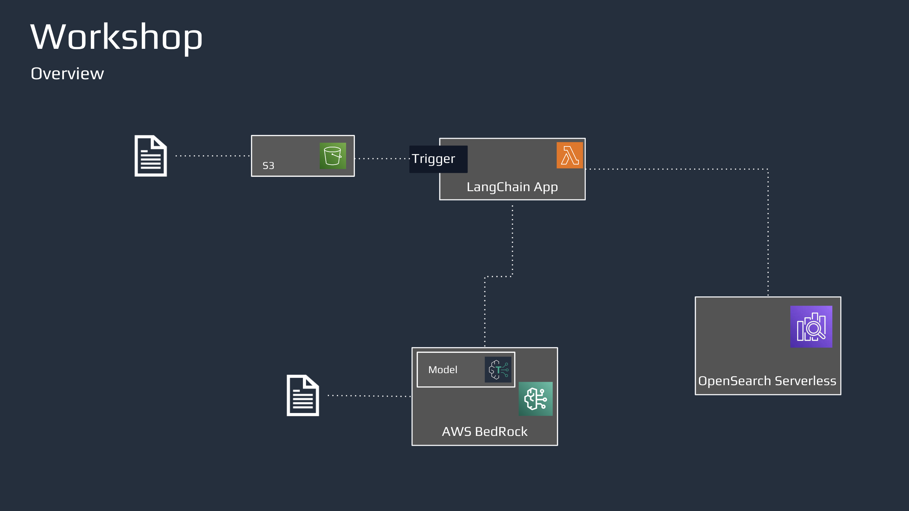
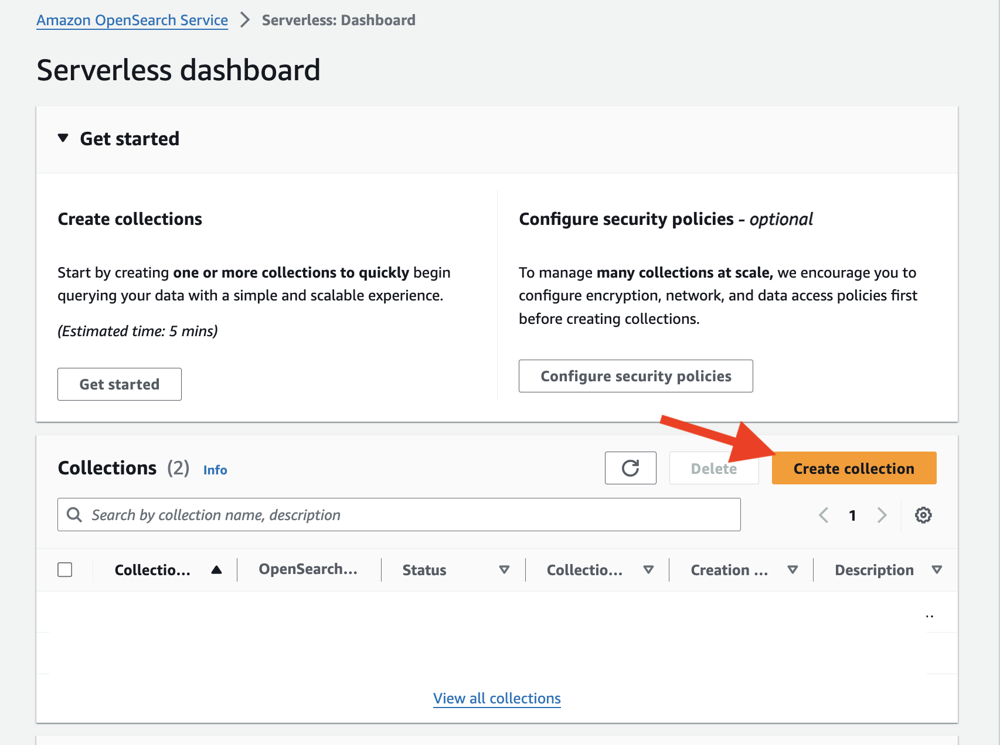
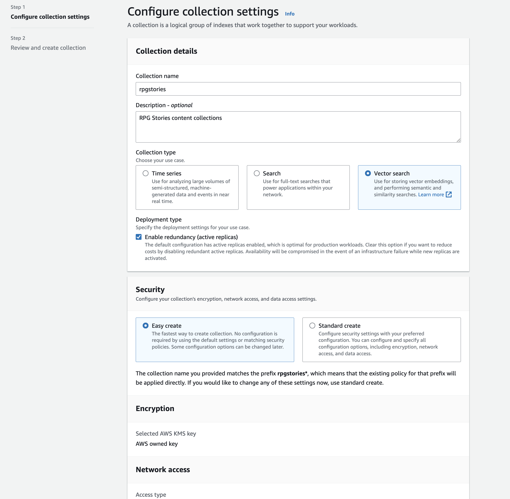
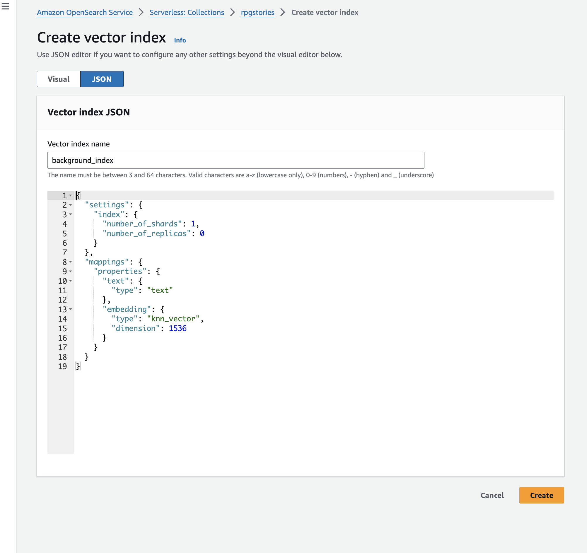
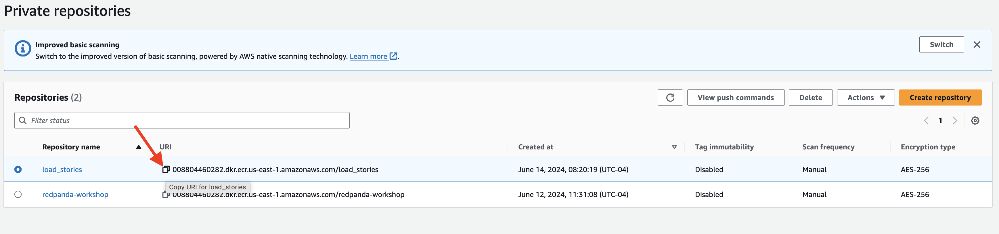
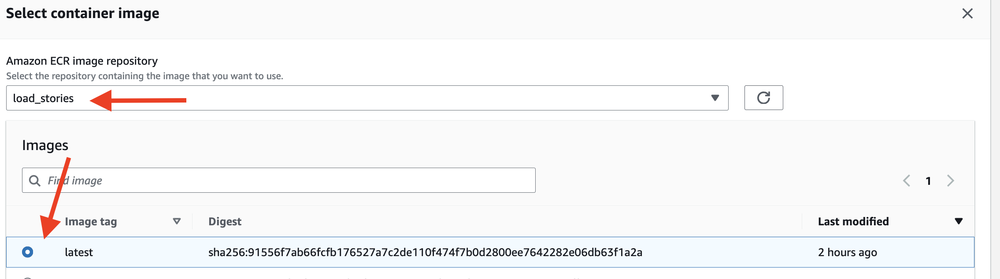
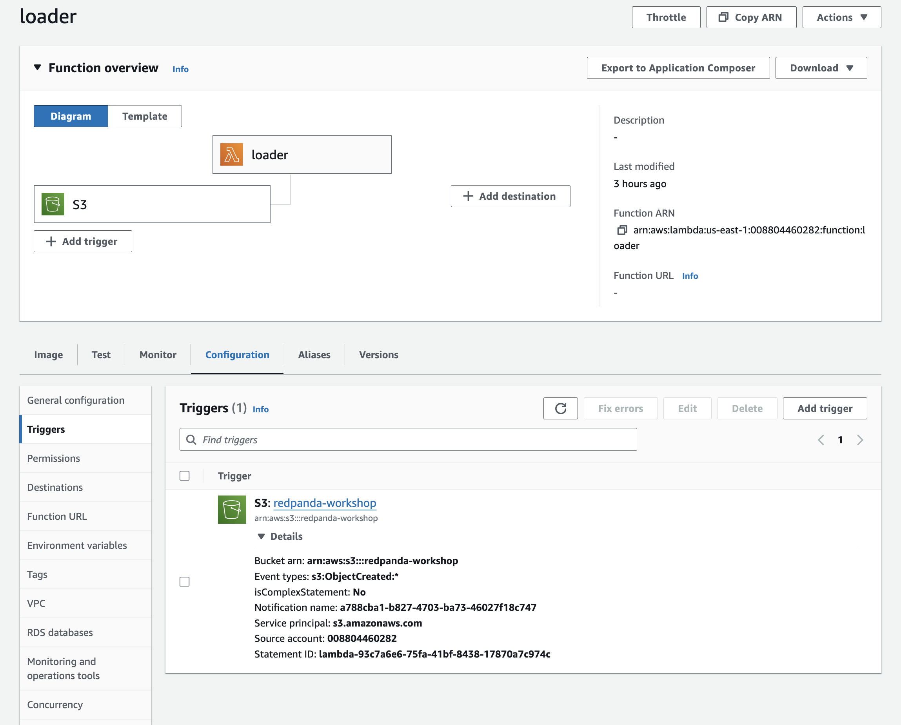
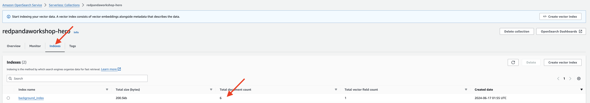

## Document Loading with RAG and OpenSearch

Retrieval-Augmented Generation (RAG) is an advanced approach that combines the strengths of retrieval-based methods and generative models to enhance the quality and relevance of generated content. Unlike traditional generative models that rely solely on their internal knowledge, RAG incorporates external data sources during the generation process, leading to more accurate and contextually relevant outputs.

In many online RPGs, NPC dialogues are pre-scripted and static, which limits their ability to respond to players in a contextually relevant and interesting manner. RAG overcomes this limitation by allowing NPCs to pull relevant information from a vast database and generate responses that are both accurate and engaging. This approach ensures that NPCs can provide up-to-date and contextually appropriate responses, significantly enhancing the player's immersive experience.

Benefits of RAG :

- Enhanced Accuracy: NPCs can provide accurate and relevant information by retrieving data from external databases, reducing the likelihood of repetitive or irrelevant dialogue.
- Contextual Relevance: NPC interactions are grounded in real-time data, making them more responsive to the player's actions and the evolving game environment.
- Dynamic Content: NPCs can generate a wider variety of responses, keeping the gameplay fresh and engaging for players over time.
- Improved Engagement: By offering intelligent and varied interactions, NPCs can better engage players, contributing to a richer gaming experience. 

We can use RAG to build dynamic quest dialogues where NPCs can provide real-time updates on quests, draw on the latest player actions and game developments, and offer tailored advice and hints based on the player's progress and current challenges. This approach leverages the best of AI and cloud computing to create an immersive, responsive, and cost-effective gaming experience, revolutionizing the way players interact with NPCs in online RPG games.

### Setup S3 bucket to upload story documents

- Open the Amazon S3 console at https://console.aws.amazon.com/s3/.
- Click on the "Create bucket" button to create a **General Purpose** Bucket: 
- Enter a name `redpanda-workshop-<YOUR_NAME>` for your bucket, go ahead with default values, and create.
- Once the bucket is created, you can use it to upload the story documents.

### Create a Collection in OpenSearch Serverless

In our quest to make NPC interactions in RPG games more dynamic and engaging, we are leveraging RAG, and a critical component of this system is the vector database. A vector database stores high-dimensional vectors generated from text and other data types, enabling fast and accurate similarity searches. When an NPC receives a query from a player, the vector representation of the query is matched against vectors in the database to retrieve the most relevant information. This efficient retrieval process ensures that NPC responses are contextually appropriate and up-to-date, significantly enhancing the immersive experience. By integrating vector databases into our serverless architecture, we can handle large volumes of data and provide real-time, intelligent NPC interactions that adapt to the evolving game environment and player actions.



OpenSearch is an open-source search and analytics engine that also supports vector search capabilities, enabling efficient handling of high-dimensional data for similarity searches. This makes it suitable for applications requiring fast and accurate retrieval of relevant information based on vector representations, such as in RAG systems.

We'll start by creating a collection in OpenSearch, 

- Navigate to Amazon OpenSearch Service console at https://console.aws.amazon.com/opensearch-service/.
- Select **Serverless** and click Get Started.
- In the Serverless dashboard, click on **create collections** button.

- On the "Create collection" page, provide the following details, and submit.
    - Collection name: Enter name `rpgstories` for your collection.
    - Collection type: Select **Vector search**
    - Security : Choose **Easy create**


Click on the "Create collection" button to create the collection.

### Add Index to the Collection
Index is a data structure that enables efficient retrieval of high-dimensional vectors by organizing and storing them in a way that facilitates fast similarity searches. This indexing process transforms the vectors into a format that allows the database to quickly identify and retrieve the most relevant vectors in response to a query. Using advanced algorithms, such as approximate nearest neighbor (ANN) search, the index significantly enhances the performance and scalability of the vector database, making it ideal for applications like real-time data processing and retrieval-augmented generation (RAG) systems.

- On the collection details page, click on the **Indexes** tab.
- Click on the **Create vector index** button.
- Select the **JSON** tab
- Enter `background_index` as the Vector index name
- Create index with following setting and 

```
{
  "settings": {
    "index": {
      "number_of_shards": 1,
      "number_of_replicas": 0,
      "knn": true
    }
  },
  "mappings": {
    "properties": {
      "text": {
        "type": "text"
      },
      "vector_field": {
        "type": "knn_vector",
        "dimension": 1536
      }
    }
  }
}
```


Once the collection and index are created, you can start adding documents to it and perform various operations like searching, filtering, and aggregating data.

### Setup a Container Registry
- Navigate to the Amazon ECR dashboard, configure the Repository with following settings:

**Repository name**: `load_stories`.
**Visibility settings**:  `Private`, The repository is only accessible to your AWS account.

- Review your settings and click the Create repository button.
- Copy the URI and have it handy 




### Building the document loader application
We'll load the story context documents to the vector database.

- In the cloud9 workspace, create a new directory `loader` as the working directory for this section. This directory will be used for building an AI inference app using LangChain for your Hero NPC.
  
```
cd ~
mkdir environment/loader
cd environment/loader
```

- Create a file named `lambda_function.py`:

```
import boto3
import json
from opensearchpy import OpenSearch, RequestsHttpConnection, AWSV4SignerAuth
from langchain_community.embeddings import BedrockEmbeddings
from opensearchpy.helpers import bulk, BulkIndexError
import os

# OpenSearch configuration
host = os.getenv("OPENSEARCH_HOST")
region = 'us-east-1'
service = 'aoss'
index_name = 'background_index'

# Initialize Boto3 session
session = boto3.Session()

# Initialize OpenSearch client
credentials = session.get_credentials()
auth = AWSV4SignerAuth(credentials, region, service)
client = OpenSearch(
    hosts=[{'host': host, 'port': 443}],
    http_auth=auth,
    use_ssl=True,
    verify_certs=True,
    connection_class=RequestsHttpConnection
)
 # Initialize S3 client
s3 = boto3.client('s3')
bedrock = session.client(service_name="bedrock-runtime")

# Initialize the BedrockEmbeddings model
embeddings_model = BedrockEmbeddings(model_id="amazon.titan-embed-text-v1", client=bedrock)

def lambda_handler(event, context):
   
    # Get the S3 bucket and object keys from the event
    bucket = event['Records'][0]['s3']['bucket']['name']
    keys = [record['s3']['object']['key'] for record in event['Records']]
    
    # List to store documents for bulk indexing
    docs_to_index = []
    
    # Process each document
    for key in keys:
        print(f"Processing document: {key}")
        # Read the document from S3
        obj = s3.get_object(Bucket=bucket, Key=key)
        document_content = obj['Body'].read().decode('utf-8')

        # Create a document object
        documents = [document_content]
        texts = [doc for doc in documents]

        # Generate embeddings for the document
        embeddings = embeddings_model.embed_documents(texts)

        # Prepare documents for indexing
        for i, (doc, embedding) in enumerate(zip(documents, embeddings)):
            doc_body = {
                'text': doc,
                'vector_field': embedding
            }
            # Add the document to the bulk request
            docs_to_index.append({
                '_op_type': 'index',
                '_index': index_name,
                '_source': doc_body
            })
    
    # Bulk insert documents and handle errors
    try:
        bulk(client, docs_to_index)
        print("Documents indexed successfully.")

       
    except BulkIndexError as e:
        print(f"Bulk indexing error: {e}")
        for error in e.errors:
            print(error)

    return {
        'statusCode': 200,
        'body': json.dumps('Documents indexed successfully')
    }


```

The function processes text documents uploaded to an S3 bucket, generates embeddings using the BedrockEmbeddings model from Amazon Bedrock, and indexes these documents into an OpenSearch cluster. Upon invocation, the function retrieves the document content from S3, generates text embeddings for each document, and prepares them for indexing. It then performs a bulk insert of the documents into the specified OpenSearch index, handling any potential errors during the process.


### Package Loader Application in container

- Create a file name `Dockerfile` 
  
```
FROM public.ecr.aws/lambda/python:3.12

# Copy requirements.txt

# Install the specified packages
RUN pip install langchain_community
RUN pip install langchain
RUN pip install boto3
RUN pip install botocore
RUN pip install opensearch-py

# Copy function code
COPY lambda_function.py ${LAMBDA_TASK_ROOT}

# Set the CMD to your handler (could also be done as a parameter override outside of the Dockerfile)
CMD ["lambda_function.lambda_handler"]
```


### Build and Push the Docker Image to Amazon ECR
- Build the Docker Image, in your Cloud9 terminal:

```
docker build -t load_stories .
```

- Tag the Docker Image:
```
docker tag load_stories <your-ecr-repository-uri>
```

- Login to the ECR:
  
```
export region_name=<workshop_region>
aws ecr get-login-password --region $region_name | docker login --username AWS --password-stdin <your-loader-ecr-repository-uri>
```

Push the Docker Image, the Docker image built in the previous steps will be pushed to the specified ECR repository, making it available for deployment and use in other services or environments.

```
docker push <your-ecr-repository-uri>
```

### Create the Lambda Function from the Docker Image

- Navigate to Lambda
- Click the Create function button.
- Select Container image.
- Function name: `loader`
- Container image URI: Enter the URI of your Docker image in ECR.



Click Create function to create the function.
###  Update lambda configuration Permissions:

- In the function's configuration, click on the "Configuration" tab.
- Scroll down to the "Permissions" section, under Execution role section find the Role name, click on the `loader-role-xxxxxx` to configure the permission.


- Add the necessary following policies
  - **AmazonS3FullAccess** - allows read/write access to S3 buckets.
  - **AmazonBedrockFullAccess** - allow access to Bedrock models.
- Add the **Opensearch Serverless** permission, under **Add permission**, choose inline policies


- Grant all action by selecting **All OpernSearch Serverless actions (aoss.*)** for all resources


- Name the Policy Name to `OpenSearchServerlessAll`
- Click on the "Create Policy" button to apply the changes. 
 


ie:
```
{
			"Sid": "VisualEditor0",
			"Effect": "Allow",
			"Action": "aoss:*",
			"Resource": "*"
		}
```

- Set the timeout for your Lambda function to 30 seconds, still in the "Configuration" tab.
- Scroll down to the "General configuration" section.
- In the "Timeout" field, enter "30" (without quotes) to set the timeout to 30 seconds.
- Click on the "Save" button to apply the changes.
  
This will ensure that your Lambda function has a maximum execution time of 30 seconds before it times out and updates the permissions for your Lambda function to include the required access to AWS services and resources.

### Add Environment Variable to Lambda Function
- In the function's configuration, go to the "Configuration" tab.
- Scroll down to the "Environment variables" section.
- Click on the "Edit" button.
- Add a new environment variable with the following details:
  - Key: OPENSEARCH_HOST
  - Value: **your OpenSearch Serverless endpoint**
- Click on the "Save" button to apply the changes.


### Configure the Trigger for the Lambda Function
To configure the trigger for the Lambda function and listen to any uploaded documents into the S3 bucket, follow these steps:

- In the function's configuration, go to the "Triggers" tab.
- Click on the "Add trigger" button.
- For the trigger configuration, choose "S3".
- Enter the required details:
    - **Bucket**: Choose the `S3/redpanda-workshop-<YOUR_NAME>` bucket.
    - Check the acknowledgement box

- Click on the "Add" button to attach the trigger to your Lambda function.


### Load Story Documents
To load the story documents into the S3 bucket, follow these steps:

- Sync the downloaded documents to the S3 bucket:
```
aws s3 sync  ~/environment/aws-redpanda-workshop/story s3://redpanda-workshop-<YOUR_NAME>/
```

Once the documents are synced to the S3 bucket, you can proceed with further steps in your workflow.


### Checking import result in OpenSearch Serverless Dashboard
- Navigate to the index page of your OpenSearch Serverless instance.
- Look for the total number of documents count displayed on the index page.

The number equal to the number of documents you uploaded to the S3 Bucket.



### Conclusion

By following these steps, you have successfully set up an efficient pipeline for loading and indexing documents in OpenSearch using AWS Lambda and Docker. This integration leverages the power of Retrieval-Augmented Generation (RAG) to enhance the dynamic interactions of NPCs in RPG games, ensuring that responses are both contextually relevant and up-to-date. This setup forms the backbone of an immersive and interactive gaming experience.