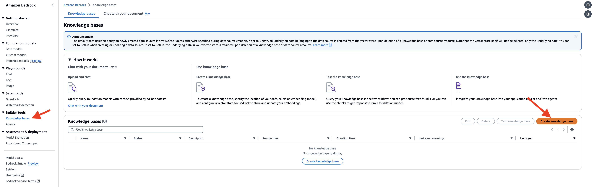
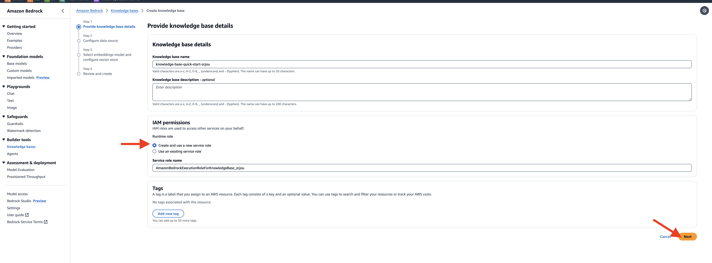
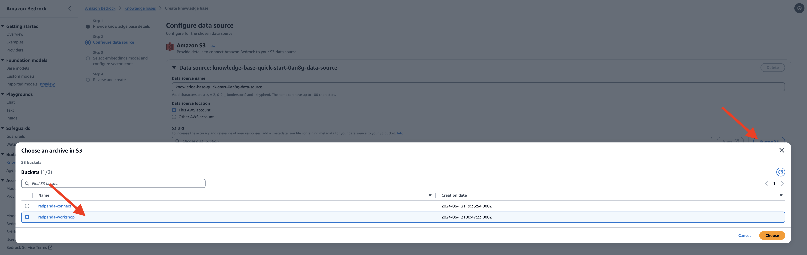
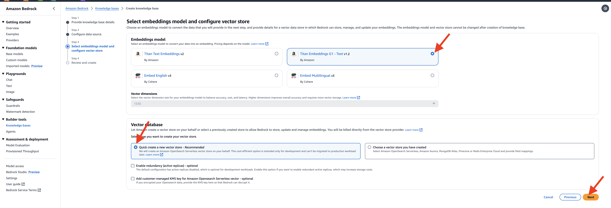
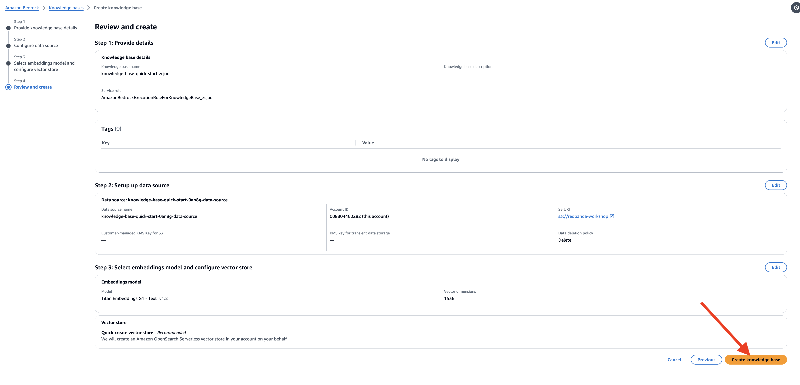
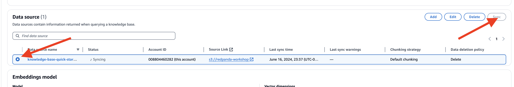
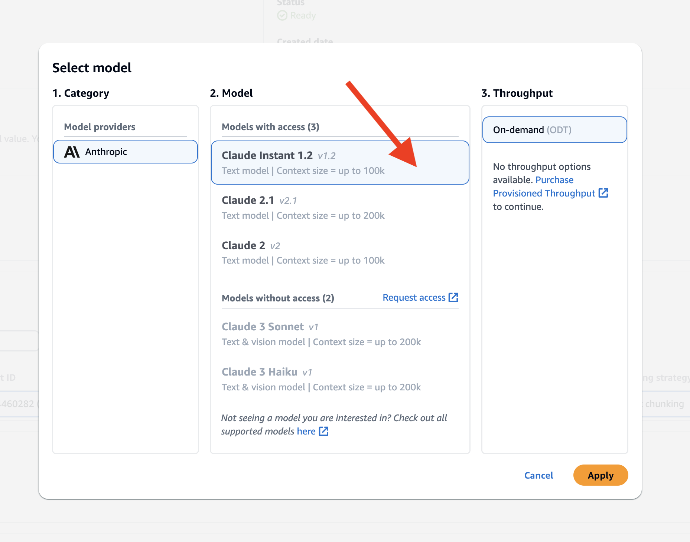
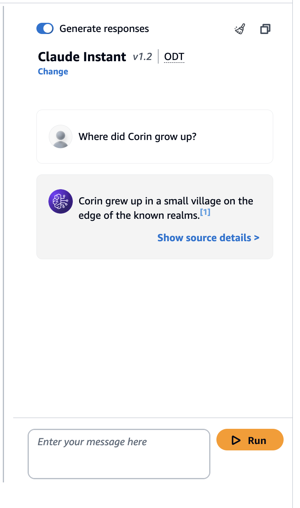
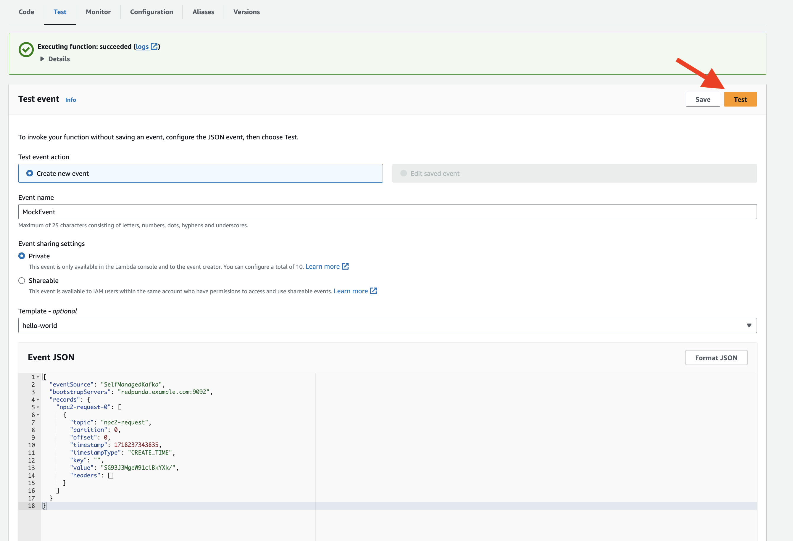

## Setup Bedrock Knowledge base

To set up the knowledge base in Amazon Bedrock, follow these steps:

- Navigate to the Amazon Bedrock service, Click on "Create Knowledge Base" to start the setup process.

- Provide a name for your knowledge base or use the default generated name, select the **create and use a new service role** and click *Next*

- In the Configure data source page, under Amazon S3 URI section, click on the **Browse S3** button, add the `redpanda-workshop` bucket  

- Select **Titan Embedding G1** as the embedding model and check the **Quick Create a new vector store**, it will create a new collection in the OpenSearch Serverless 

- Check the configuration again and click **Create knowledge base** to start creating.

- It'll take a few minutes to setup, once done, let's go ahead to sync the documents in the S3 bucket to the vector store by going to the Data source section, select the knowledge base you just created and click on the **sync** button.

- On the right-hand panel, you'll see a section to test knowledge base select **Claude Instant
v1.2** as the model

- Put in your question specific about the character, and click **Run**

- Also see the newly created collection in the OpenSearch Serverless Service


## Update the sorcerer function for the new knowledge base
Lets go back to your Hero Inference application, this time, we'll add the searched result from the vector database with similar semantics.
  
```
cd ~/sorcerer
```

- Replace the  `lambda_function.py` with the following code:
```
TODO
```

- Re-activate a virtual environment in your project directory
```
source ./env/bin/activate
```
### Creating a zip deployment package with dependencies
- Update the requirements.txt file with the following content and upload it using the Lambda function's code editor:
```
TODO
```

- Install the required libraries with pip. 
```
pip install -r requirements.txt 
```

The folder in which pip installs the libraries may be named site-packages or dist-packages. This folder may be located in either the lib/python3.x or lib64/python3.x directory

- Deactivate the virtual environment
```
deactivate
```

- Navigate into the directory containing the dependencies you installed with pip. Re-package the zip file.

```
cd env/lib/python3.12/site-packages
zip -r ../../../../askSorcerer.zip . -x "*__pycache__*" 
cd ../../../../
zip askSorcerer.zip lambda_function.py
```

### Test the Lambda Function
To test the Lambda function with a test event, 

- In the function's configuration, go to the "Test" tab.
- Enter a name for the test event (e.g., "MockEvent").
- In the event body, provide the test event JSON payload 

```
{
  "eventSource": "SelfManagedKafka",
  "bootstrapServers": "redpanda.example.com:9092",
  "records": {
    "npc2-request-0": [
      {
        "topic": "npc2-request",
        "partition": 0,
        "offset": 0,
        "timestamp": 1718237343835,
        "timestampType": "CREATE_TIME",
        "key": "",
        "value": "SG93J3MgeW91ciBkYXk/",
        "headers": []
      }
    ]
  }
}
```
- Click on the "Save" button to save the test event, and click "Test" to execute the Lambda function with the test event
