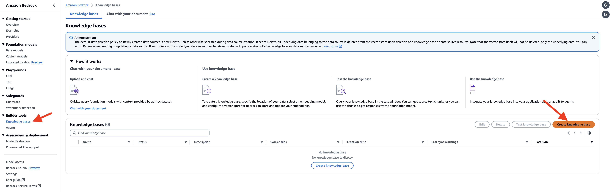
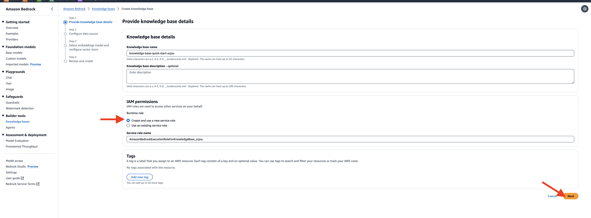
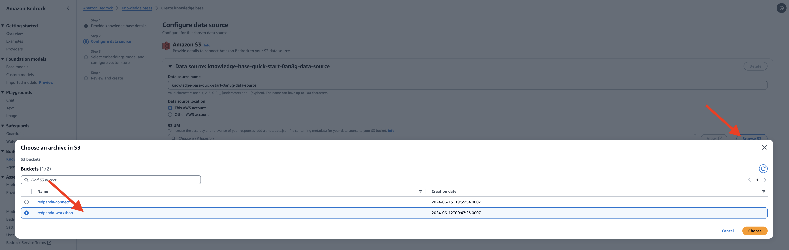
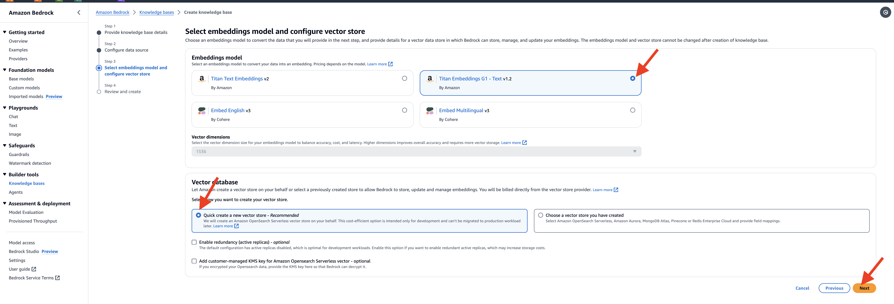
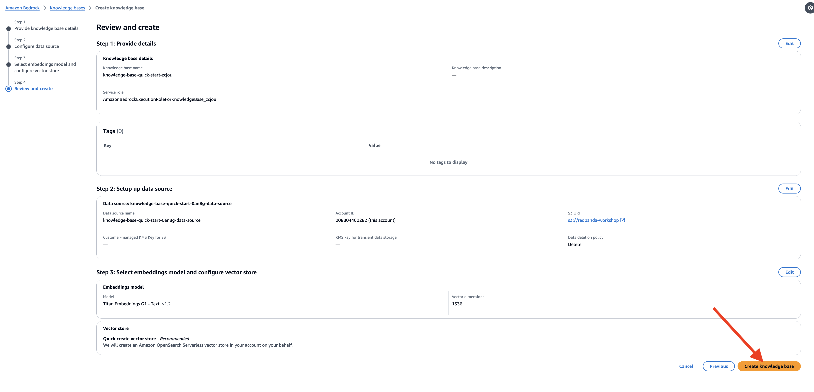
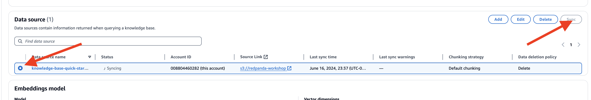
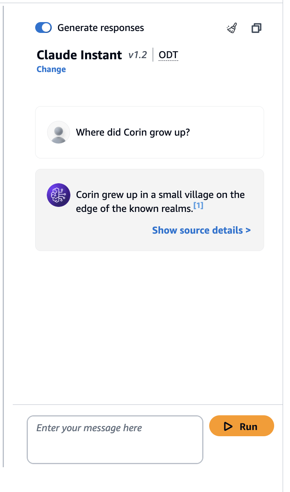
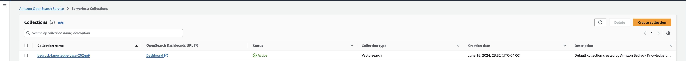

## Setup Bedrock Knowledge base

To set up the knowledge base in Amazon Bedrock, follow these steps:

- Navigate to the Amazon Bedrock service, Click on "Create Knowledge Base" to start the setup process.

- Provide a name for your knowledge base or use the default generated name, select the **create and use a new service role** and click *Next*

- In the Configure data source page, under Amazon S3 URI section, click on the **Browse S3** button, add the `redpanda-workshop` bucket  

- Select **Titan Embedding G1** as the embedding model and check the **Quick Create a new vector store**, it will create a new collection in the OpenSearch Serverless 

- Check the configuration again and click **Create knowledge base** to start creating.

- It'll take a few minutes to setup, once done, let's go ahead to sync the documents in the S3 bucket to the vector store by going to the Data source section, select the knowledge base you just created and click on the **sync** button.

- On the right-hand panel, you'll see a section to test knowledge base select **Claude Instant
v1.2** as the model

- Put in your question specific about the character, and click **Run**

- Also see the newly created collection in the OpenSearch Serverless Service

- Back in the 


## Update the sorcerer function for the new knowledge base
Lets go back to your Hero Inference application, this time, we'll add the searched result from the vector database with similar semantics.
  
```
cd ~/sorcerer
```

- Replace the  `lambda_function.py` with the following code:
```
import boto3
import json
import base64
import os
from kafka import KafkaProducer

# Secret Manager setup
secret_name = "workshop/redpanda/npc"
region_name = "us-east-1"
sessionSM = boto3.session.Session()
client = sessionSM.client(service_name='secretsmanager', region_name=region_name)
get_secret_value_response = client.get_secret_value(SecretId=secret_name)
secret = get_secret_value_response['SecretString']
secret_data = json.loads(secret)
bedrock_key = secret_data['BEDROCK_KEY']
bedrock_secret = secret_data['BEDROCK_SECRET']
broker = secret_data['REDPANDA_SERVER']
rp_user = secret_data['REDPANDA_USER']
rp_pwd = secret_data['REDPANDA_PWD']

# Kafka Producer setup
producer = KafkaProducer(
    bootstrap_servers=[broker],
    security_protocol="SASL_SSL",
    sasl_mechanism="SCRAM-SHA-256",
    sasl_plain_username=rp_user,
    sasl_plain_password=rp_pwd,
    value_serializer=lambda v: json.dumps(v).encode('utf-8')  # Serializer to convert to JSON
)

# Bedrock client setup
boto3_session = boto3.session.Session()
region = boto3_session.region_name
bedrock_agent_runtime_client = boto3.client('bedrock-agent-runtime')

# Get knowledge base id from environment variable
kb_id = os.environ.get("KNOWLEDGE_BASE_ID")

# Declare model id for calling RetrieveAndGenerate API
model_id = "anthropic.claude-instant-v1"
model_arn = f'arn:aws:bedrock:{region}::foundation-model/{model_id}'

def prepare_prompt(input_query, context):
    prompt = f"""You must provide an answer in under 5 sentences.
    Context: You are a sorcerer who lives in the fantasy world, specialized in light magic, but you are familiar with other elements. You must provide an answer. You have a hot-cold personality type, normally being sharp but at some point suddenly becoming lovestruck. You are in your 20s, and female.
    Context: {context}
    User: {input_query}
    """
    return prompt


def retrieve_and_generate(input_text, kb_id, model_arn):
    prompt = prepare_prompt(input_text, "")
    response = bedrock_agent_runtime_client.retrieve_and_generate(
        input={'text': prompt},
        retrieveAndGenerateConfiguration={
            'type': 'KNOWLEDGE_BASE',
            'knowledgeBaseConfiguration': {
                'knowledgeBaseId': kb_id,
                'modelArn': model_arn
            }
        }
    )
    print(f"Response from Bedrock: {response}")
    return response['output']['text']

def lambda_handler(event, context):
    print(f'event message: {event}')
    for topic_partition, records in event['records'].items():
        for record in records:
            question = base64.b64decode(record['value']).decode('utf-8')  # Adjust based on actual message format
            print(f"Received message: {question}")

            # Retrieve and generate response from Bedrock
            response_text = retrieve_and_generate(question, kb_id, model_arn)

            message_data = {
                "who": "npc2",
                "msg": response_text
            }
            producer.send('rpg-response', message_data)
            producer.flush()

    return {
        'statusCode': 200,
        'body': json.dumps({'message': 'Message processed and sent to Kafka'})
    }

```
- You'll notice that we use **Claude V1** as the model, since at the time this workshop is written, Claude is the only available model for Bedrock knowledge base, if you would like to use other models, please use the method we demonstrate in the previous steps. 
  


### Creating a zip deployment package with dependencies

- Since we are not introducing any new libraries, there is no need to rebuild the library package, instead, we only need to update the **lambda_function.py** in the packaged zip file.

- In the directory containing the dependencies you installed with pip. Re-package the zip file.
  
```
zip askSorcerer.zip lambda_function.py
```

### Test the Lambda Function
To test the Lambda function with a test event, 

- In the function's configuration, go to the "Test" tab.
- Enter a name for the test event (e.g., "MockEvent").
- In the event body, provide the test event JSON payload 

```
{
  "eventSource": "SelfManagedKafka",
  "bootstrapServers": "redpanda.example.com:9092",
  "records": {
    "npc2-request-0": [
      {
        "topic": "npc2-request",
        "partition": 0,
        "offset": 0,
        "timestamp": 1718237343835,
        "timestampType": "CREATE_TIME",
        "key": "",
        "value": "V2hhdCBtYWdpYyBhcmUgeW91IGdvb2QgYXQ/",
        "headers": []
      }
    ]
  }
}
```
- Click on the "Save" button to save the test event, and click "Test" to execute the Lambda function with the test event
