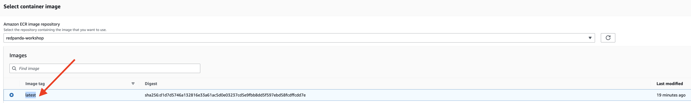
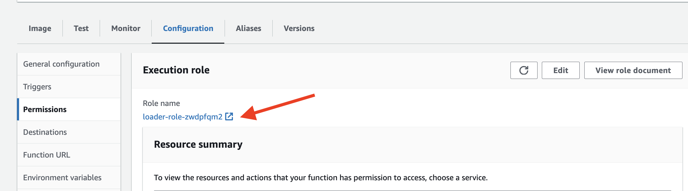
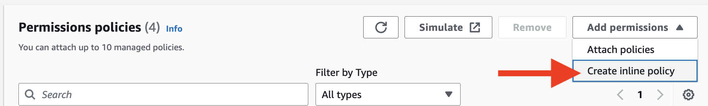
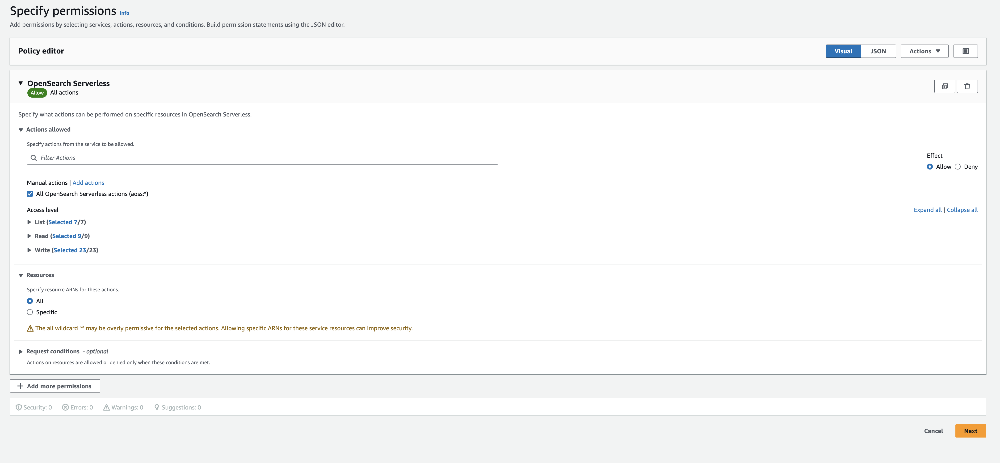
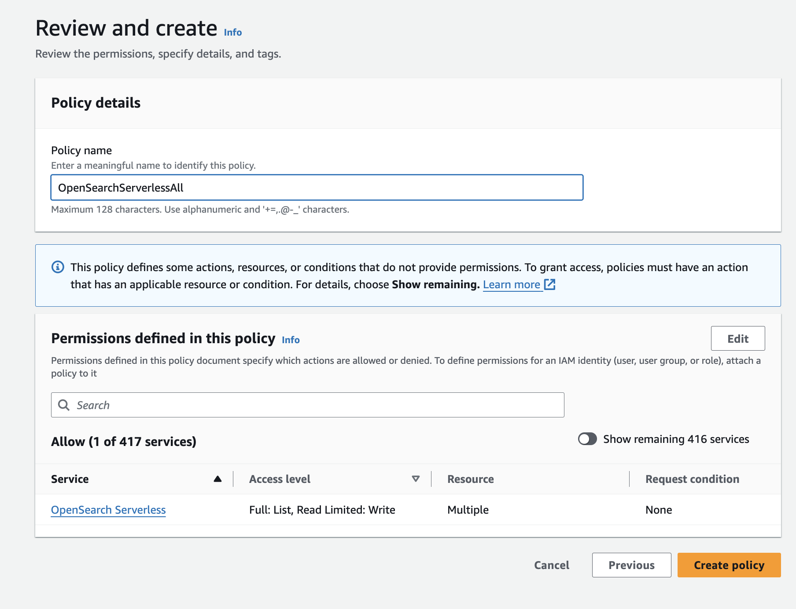
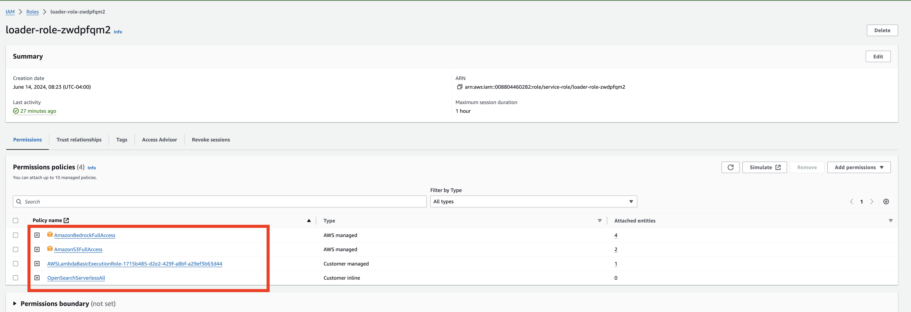
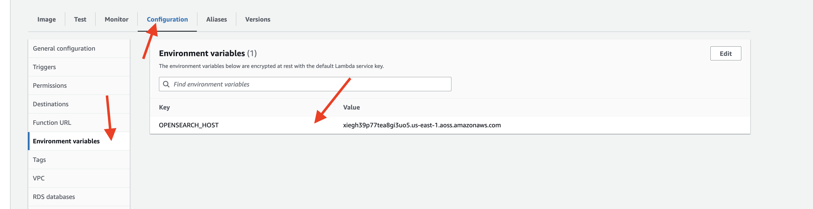

## Dynamic NPC Interactions with Retrieval-Augmented Generation

Retrieval-Augmented Generation (RAG) leverages both retrieval-based methods and generative models to enhance the quality and relevance of generated content. By incorporating external data sources during the generation process, RAG ensures that the responses provided by NPCs in online RPGs are not only accurate but also contextually appropriate. This significantly enhances the immersive experience for players, making NPC interactions more engaging and dynamic. Follow the steps below to update your Lambda function and deploy it using Docker.


## Update the previous LangChain function to enable RAG
First, navigate to your Hero Inference application directory:
  
```
cd ~/environment/hero
```

- Replace the  `lambda_function.py` with the following code:

```
import json
import base64
import os
import boto3
from kafka import KafkaProducer
from langchain_community.llms import Bedrock
from langchain_aws import BedrockLLM
from langchain.chains import RetrievalQA
from langchain_core.prompts import PromptTemplate
from opensearchpy import OpenSearch, RequestsHttpConnection, AWSV4SignerAuth
from langchain_community.embeddings import BedrockEmbeddings
from langchain_community.vectorstores import OpenSearchVectorSearch

# Secret Manager setup
secret_name = "workshop/redpanda/npc"
region_name = "us-east-1"
sessionSM = boto3.session.Session()
client = sessionSM.client(service_name='secretsmanager', region_name=region_name)
get_secret_value_response = client.get_secret_value(SecretId=secret_name)
secret = get_secret_value_response['SecretString']
secret_data = json.loads(secret)
broker = secret_data['REDPANDA_SERVER']
rp_user = secret_data['REDPANDA_USER']
rp_pwd = secret_data['REDPANDA_PWD']
opensearch_host = os.getenv("OPENSEARCH_HOST")
index_name = 'background_index'

# Kafka Producer setup
producer = KafkaProducer(
    bootstrap_servers=[broker],
    security_protocol="SASL_SSL",
    sasl_mechanism="SCRAM-SHA-256",
    sasl_plain_username=rp_user,
    sasl_plain_password=rp_pwd,
    value_serializer=lambda v: json.dumps(v).encode('utf-8')  # Serializer to convert to JSON
)

# LangChain setup
session = boto3.Session(region_name=region_name)
boto3_bedrock = session.client(service_name="bedrock-runtime")

# OpenSearch setup
credentials = session.get_credentials()
auth = AWSV4SignerAuth(credentials, region_name, 'aoss')
aoss_client = OpenSearch(
    hosts=[{'host': opensearch_host, 'port': 443}],
    http_auth=auth,
    use_ssl=True,
    verify_certs=True,
    connection_class=RequestsHttpConnection
)

# Langchain LLM
llm = BedrockLLM(client=boto3_bedrock, model_id="meta.llama2-13b-chat-v1", region_name=region_name)

# Initialize the BedrockEmbeddings model
embedding_model = BedrockEmbeddings(model_id="amazon.titan-embed-text-v1", client=boto3_bedrock)


vector_store = OpenSearchVectorSearch(
    opensearch_url="https://"+opensearch_host,
    http_auth=auth,
    use_ssl=True,
    verify_certs=True,
    connection_class=RequestsHttpConnection,
    embedding_function=embedding_model,
    index_name = index_name
)


def lambda_handler(event, context):
    for topic_partition, records in event['records'].items():
        for record in records:
            question = base64.b64decode(record['value']).decode('utf-8')
            print(f"Received message: {question}")
            
            # Generate the response
            try:
                response_msg = query_data(question)
                print(f'Response message: {response_msg}')
            except Exception as e:
                print(f"Error generating response: {e}")
                continue
            
            # Send response back via Kafka
            try:
                message_data = {
                    "who": "npc1",
                    "msg": response_msg
                }
                producer.send('rpg-response', message_data)
                producer.flush()
            except Exception as e:
                print(f"Error sending message to Kafka: {e}")

def query_data(question):
    # Generate a response using the RetrievalQA chain


    # Define the prompt template
    prompt_template = """
    Answer no longer than 5 sentences.You are a hero who lives in the fantasy world, you just defeated a monster, has been asked a question. Sound more upbeat tone.

    Context: {context}

    Question: {question}
    """
    PROMPT = PromptTemplate(input_variables=["context", "question"], template=prompt_template)

    # Create the RetrievalQA instance
    qa = RetrievalQA.from_chain_type(
        llm=llm,
        retriever=vector_store.as_retriever(),
        return_source_documents=False,
        chain_type_kwargs={"prompt": PROMPT},
    )
    response = qa({"query": question, "question": question})
    return response["result"].replace("Answer: ", "", 1)
```

This function processes incoming questions, leveraging Retrieval-Augmented Generation (RAG). When a question is received via Kafka, it decodes the question and queries a vector database using OpenSearch to retrieve contextually relevant information. It then generates an engaging, contextually appropriate response using a pre-defined prompt template and the LangChain library, specifically the Bedrock LLM model. The response is then sent back to the game via Kafka, enhancing the NPC's ability to provide dynamic and immersive interactions with players. This setup ensures that the NPC's dialogue is both relevant and enriched with up-to-date information from the vector database.

### Rebuild and Push the Docker Image to Amazon ECR

The <your-ecr-repository-uri> should be your first registry you created for the **askhero** function named redpanda-workshop.

- Build the Docker Image:
Open a terminal and navigate to the directory containing your Dockerfile.
Build the Docker image:

```
docker build -t askhero .
```

Tag the Docker Image:
```
docker tag askhero <your-ecr-repository-uri>
```

- Login to the registry
  
```
aws ecr get-login-password --region us-east-1 | docker login --username AWS --password-stdin <your-ecr-repository-uri>
```

- By running the pish command, the Docker image built in the previous steps will be pushed to the specified ECR repository.

```
docker push <your-ecr-repository-uri>
```

### Update the `addhero` Lambda Function from the Docker Image

- Navigate to Lambda
- Select the function name: `addhero`
- Under the image tab, click on **Deploy new image**
- In the Container image settings page, click on **Browse images**
- In the Select container image page, select the redpanda-workshop repository
- Click on the latest tag 



- Save and wait till it to deploy. 

###  Update lambda configuration Permissions:

- In the function's configuration, click on the "Configuration" tab.
- Scroll down to the "Permissions" section, under Execution role section find the Role name, click on the `loader-role-xxxxxx` to configure the permission.


- Add the Opensearch Serverless permission, under **Add permission**, choose inline policies

- Grant all action by selecting **All OpernSearch Serverless actions (aoss.*)** for all resources


- Name the Policy Name to `OpenSearchServerlessAll`
- Click on the "Create Policy" button to apply the changes. 
 



ie:
```
{
			"Sid": "VisualEditor0",
			"Effect": "Allow",
			"Action": "aoss:*",
			"Resource": "*"
		}
```

- Click on the "Save" button to apply the changes.
  
This will ensure that your Lambda function has a maximum execution time of 30 seconds before it times out and update the permissions for your Lambda function to include the required access to AWS services and resources.

### Add Environment Variable to Lambda Function
- In the function's configuration, go to the "Configuration" tab.
- Scroll down to the "Environment variables" section.
- Click on the "Edit" button.
- Add a new environment variable with the following details:
  - Key: `OPENSEARCH_HOST`
  - Value: **your OpenSearch Serverless endpoint**
- Click on the "Save" button to apply the changes.




### Test the Lambda Function
To test the Lambda function with a test event, 

- In the function's configuration, go to the "Test" tab.
- In the event body, provide the test event JSON payload 

```
{
  "eventSource": "SelfManagedKafka",
  "bootstrapServers": "redpanda.example.com:9092",
  "records": {
    "npc2-request-0": [
      {
        "topic": "npc1-request",
        "partition": 0,
        "offset": 0,
        "timestamp": 1718237343835,
        "timestampType": "CREATE_TIME",
        "key": "",
        "value": "SG93J3MgeW91ciBkYXk/",
        "headers": []
      }
    ]
  }
}
```

## Test with the Frontend
Back to Cloud9 that is running the frontend of your prototype game. Interact with the game, asking few questions about the world like:

- Can you tell me about the your adventure in Dracoria?
- What do you know about the Dragon King?
- Have you been to the southern realm?
  


## Conclusion
By integrating Retrieval-Augmented Generation (RAG) with OpenSearch and updating the Hero Inference application, we have significantly enhanced the capability of NPCs to provide contextually relevant and engaging