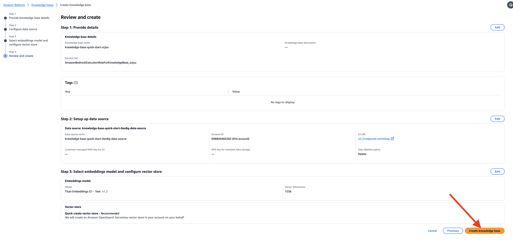
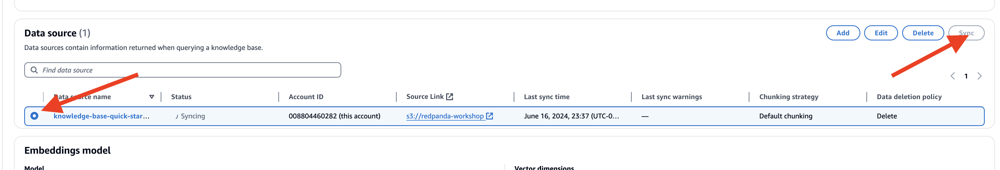
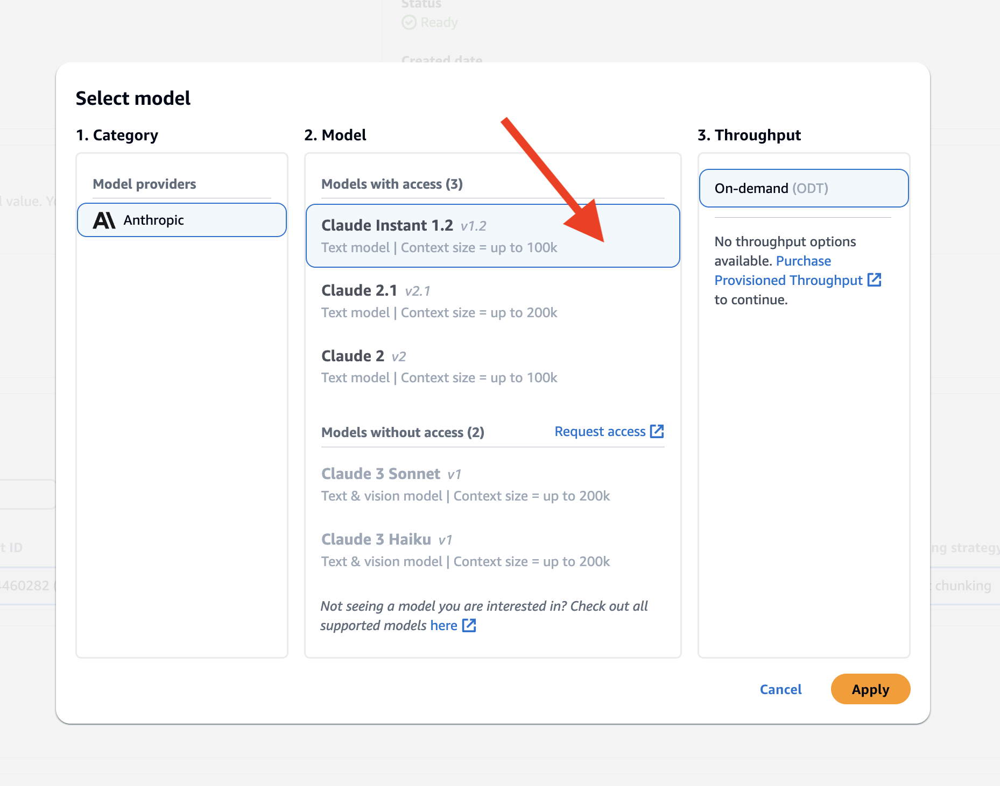
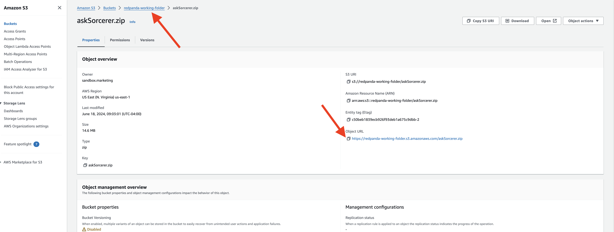
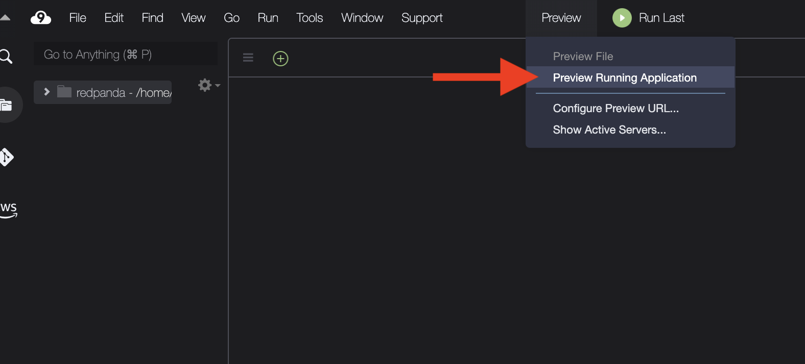

## Bedrock Knowledge Base for Enhanced NPC Interactions 
In this section, we will set up a knowledge base using Amazon Bedrock to enhance the dynamic interactions of NPCs (Non-Player Characters) in our RPG game. By integrating the knowledge base with a vector database and leveraging advanced AI models, we will create NPCs capable of generating contextually relevant and engaging responses. This approach ensures that NPC interactions are more immersive and responsive, enhancing the overall player experience.


### Setup Bedrock Knowledge base
To set up the knowledge base in Amazon Bedrock, follow these steps:

- **Navigate to the Amazon Bedrock Service**: Click on "Create Knowledge Base" to start the setup process.

- **Provide a Name for Your Knowledge Base:** Use the default generated name or provide a custom name. Select "Create and use a new service role" and click "Next."

- In the Configure data source page, under Amazon S3 URI section, click on the **Browse S3** button, add the `redpanda-workshop` bucket  

- **Select Embedding Model**: Choose "Titan Embedding G1" as the embedding model and check "Quick Create a new vector store." This will create a new collection in the OpenSearch Serverless. 

- **Review Configuration:** Verify the configuration and click "Create knowledge base" to start the creation process.

- **Sync Documents to Vector Store:** Once the knowledge base is set up, go to the Data source section, select the knowledge base you created, and click the "sync" button to sync the documents in the S3 bucket to the vector store.

- **Test the Knowledge Base:** On the right-hand panel, select "Claude Instant v1.2" as the model, enter a specific question about the character, and click "Run."


- Verify Collection in OpenSearch Serverless: Check the newly created collection in the OpenSearch Serverless Service.

- Back in the 


## Update the Sorcerer Function for the New KnowledgeBase
Now, let's update the Hero Inference application to include the searched results from the vector database with similar semantics.
  
```
cd ~/environment/sorcerer
```

- Replace the  `lambda_function.py` with the following code:
```
import boto3
import json
import base64
import os
from kafka import KafkaProducer

# Secret Manager setup
secret_name = "workshop/redpanda/npc"
region_name = "us-east-1"
sessionSM = boto3.session.Session()
client = sessionSM.client(service_name='secretsmanager', region_name=region_name)
get_secret_value_response = client.get_secret_value(SecretId=secret_name)
secret = get_secret_value_response['SecretString']
secret_data = json.loads(secret)
bedrock_key = secret_data['BEDROCK_KEY']
bedrock_secret = secret_data['BEDROCK_SECRET']
broker = secret_data['REDPANDA_SERVER']
rp_user = secret_data['REDPANDA_USER']
rp_pwd = secret_data['REDPANDA_PWD']

# Kafka Producer setup
producer = KafkaProducer(
    bootstrap_servers=[broker],
    security_protocol="SASL_SSL",
    sasl_mechanism="SCRAM-SHA-256",
    sasl_plain_username=rp_user,
    sasl_plain_password=rp_pwd,
    value_serializer=lambda v: json.dumps(v).encode('utf-8')  # Serializer to convert to JSON
)

# Bedrock client setup
boto3_session = boto3.session.Session()
region = boto3_session.region_name
bedrock_agent_runtime_client = boto3.client('bedrock-agent-runtime')

# Get knowledge base id from environment variable
kb_id = os.environ.get("KNOWLEDGE_BASE_ID")

# Declare model id for calling RetrieveAndGenerate API
model_id = "anthropic.claude-instant-v1"
model_arn = f'arn:aws:bedrock:{region}::foundation-model/{model_id}'

def prepare_prompt(input_query, context):
    prompt = f"""You must provide an answer in under 5 sentences.
    Context: You are a sorcerer who lives in the fantasy world, specialized in light magic, but you are familiar with other elements. You must provide an answer. You have a hot-cold personality type, normally being sharp but at some point suddenly becoming lovestruck. You are in your 20s, and female.
    Context: {context}
    User: {input_query}
    """
    return prompt


def retrieve_and_generate(input_text, kb_id, model_arn):
    prompt = prepare_prompt(input_text, "")
    response = bedrock_agent_runtime_client.retrieve_and_generate(
        input={'text': prompt},
        retrieveAndGenerateConfiguration={
            'type': 'KNOWLEDGE_BASE',
            'knowledgeBaseConfiguration': {
                'knowledgeBaseId': kb_id,
                'modelArn': model_arn
            }
        }
    )
    print(f"Response from Bedrock: {response}")
    return response['output']['text']

def lambda_handler(event, context):
    print(f'event message: {event}')
    for topic_partition, records in event['records'].items():
        for record in records:
            question = base64.b64decode(record['value']).decode('utf-8')  # Adjust based on actual message format
            print(f"Received message: {question}")

            # Retrieve and generate response from Bedrock
            response_text = retrieve_and_generate(question, kb_id, model_arn)

            message_data = {
                "who": "npc2",
                "msg": response_text.replace("Answer: ", "", 1)
            }
            producer.send('rpg-response', message_data)
            producer.flush()

    return {
        'statusCode': 200,
        'body': json.dumps({'message': 'Message processed and sent to Kafka'})
    }
```
You'll notice that we use **Claude V1** as the model. At the time this workshop is written, Claude is the only available model for Bedrock knowledge base. If you would like to use other models, please use the method demonstrated in the previous steps.

### Creating a zip deployment package with dependencies

- Since we are not introducing any new libraries, there is no need to rebuild the library package, instead, we only need to update the **lambda_function.py** in the packaged zip file.

- In the directory containing the dependencies you installed with pip. Re-package the zip file.
  
```
zip askSorcerer.zip lambda_function.py
```

- Resync the `askSorcerer.zip` to the S3 working bucket **redpanda-working-folder-<YOUR_NAME>**
```
cp askSorcerer.zip ~/environment/tempupload
aws s3 sync  ~/environment/tempupload s3://redpanda-working-folder-<YOUR_NAME>/
```

### Upload the Zip File to Lambda Function:

- Back to the AWS Lambda service.
- Select `askSorcerer` Lambda function upload the zip file to.
   

- In the function's configuration, go to the "Code" tab.
- Scroll down to the "Function code" section and click on the "Upload" button.
- Choose the `askSorcerer.zip` file from your S3 **redpanda-working-folder-<YOUR_NAME>** bucket.You can copy the url from the S3 bucket dashboard.
   

- Wait for the upload to complete, and then click on the "Save" button to apply the changes.


### Test the Lambda Function
To test the Lambda function with a test event, 

- In the function's configuration, go to the "Test" tab.
- In the event body, provide the test event JSON payload 

```
{
  "eventSource": "SelfManagedKafka",
  "bootstrapServers": "redpanda.example.com:9092",
  "records": {
    "npc2-request-0": [
      {
        "topic": "npc2-request",
        "partition": 0,
        "offset": 0,
        "timestamp": 1718237343835,
        "timestampType": "CREATE_TIME",
        "key": "",
        "value": "V2hhdCBtYWdpYyBhcmUgeW91IGdvb2QgYXQ/",
        "headers": []
      }
    ]
  }
}
```
- Click on the "Save" button to save the test event, and click "Test" to execute the Lambda function with the test event


## Test with the Frontend
Back to Cloud9 that is running the frontend of your prototype game. Interact with the game, asking few questions about the world like:

- Tell me about the realm?
- What happen in Elven Lands?
- What do you know about the Fiend King?
  



## Conclusion
By setting up the Bedrock knowledge base and updating the Sorcerer function, we have significantly enhanced the dynamic interactions of NPCs in our RPG game. This setup leverages advanced AI models and a robust vector database to provide contextually relevant and engaging responses, enriching the player's immersive experience.