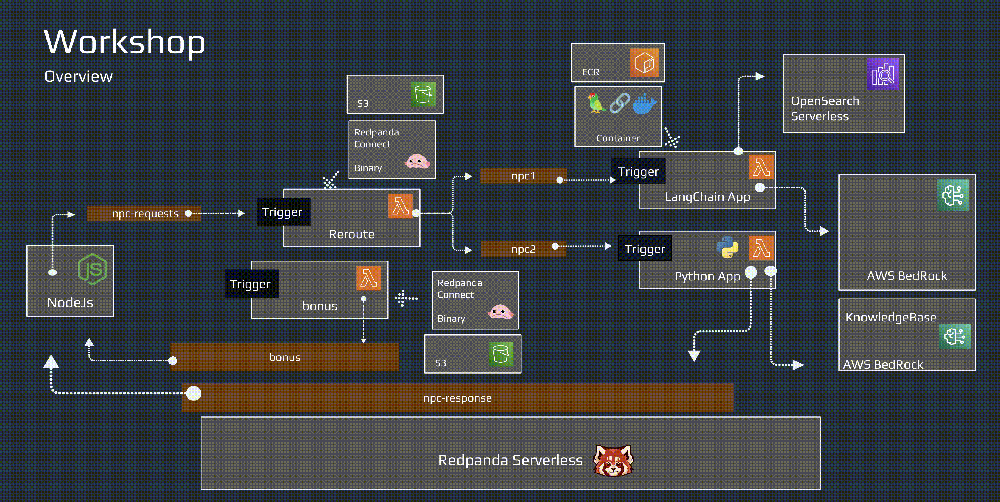
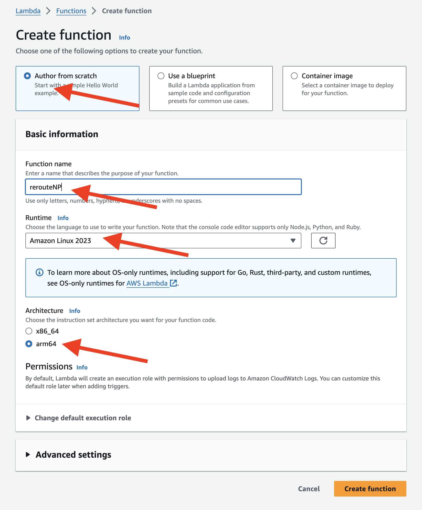
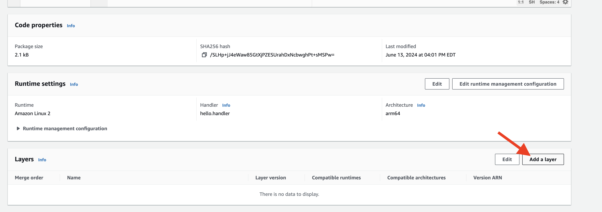
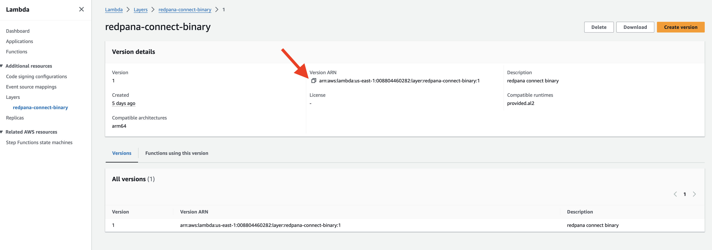
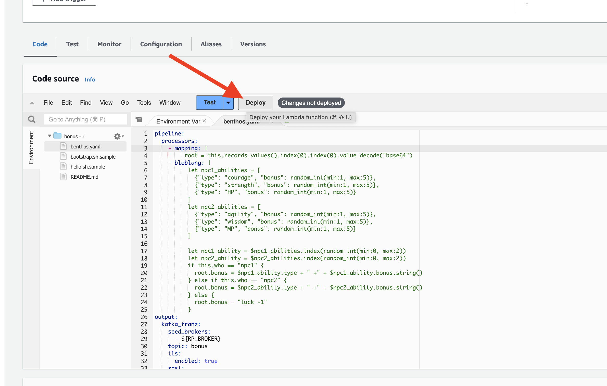
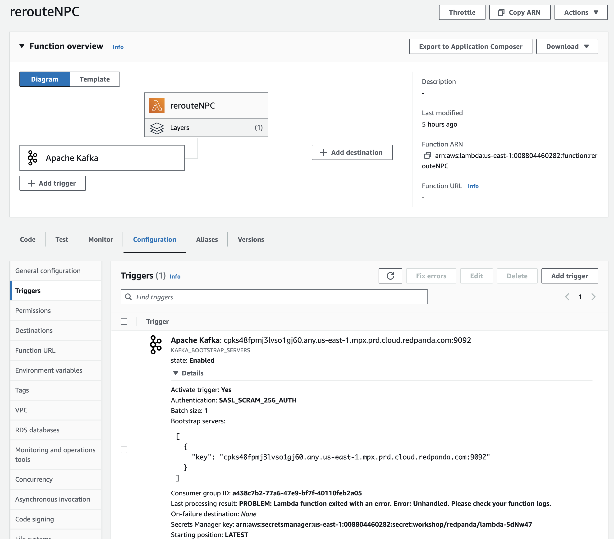
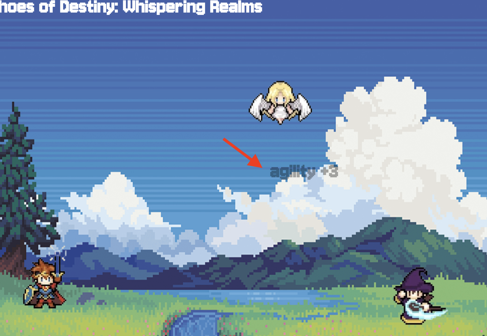
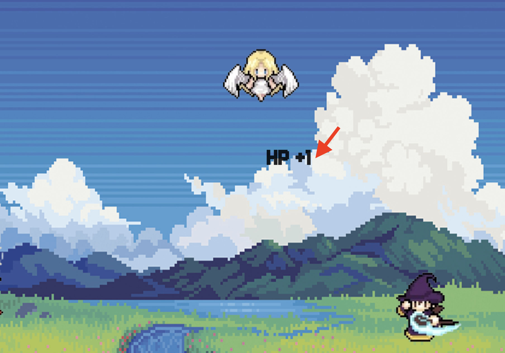
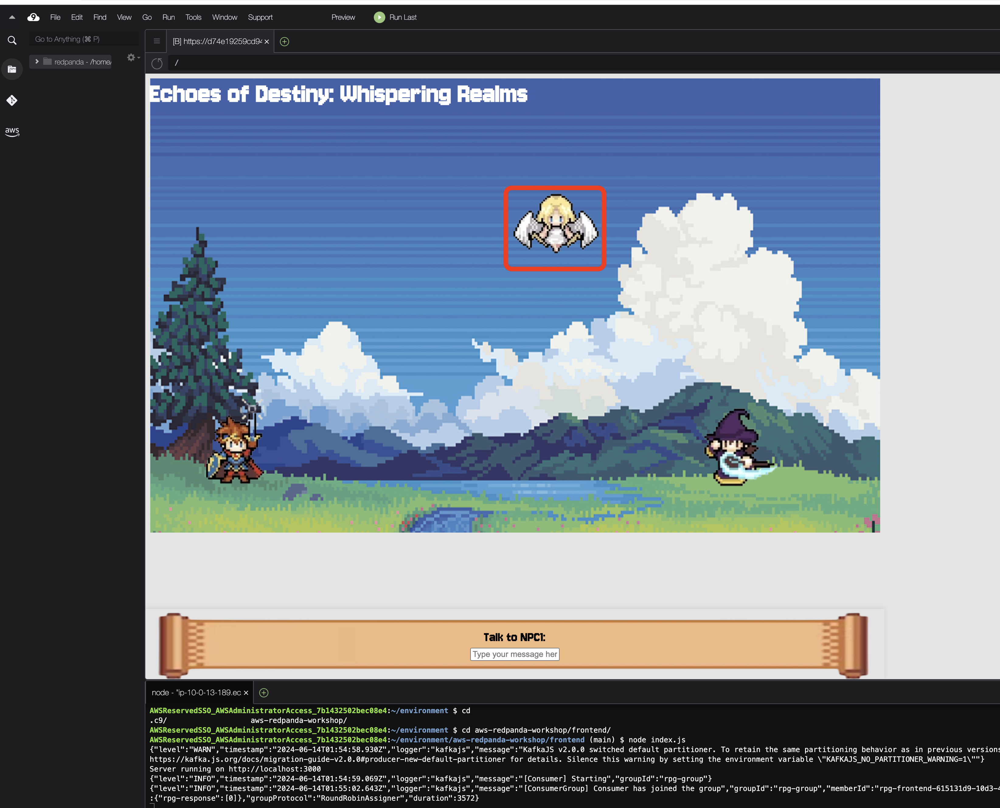

## Enhancing Player Engagement Through Event-Driven Character Abilities

Event-Driven Architecture (EDA) offers a robust framework for implementing dynamic and responsive features in online RPG games. By leveraging EDA, we can easily extend the functionalities of our game and introduce innovative mechanics that enhance player engagement and experience.

### Introducing Dynamic Character Abilities:
For the next feature, every interaction with an NPC will lead to an increase in one of the player's character abilities. Different NPCs will contribute to different types of abilities, encouraging players to engage more with the game world and its inhabitants. This will create a more immersive and interactive environment, where players are motivated to seek out and converse with NPCs, thereby deepening their connection to the game.

Benefits of Event-Driven Architecture for Feature Extension:

- Real-time Updates: With EDA, changes and updates are processed in real-time, ensuring that players experience the effects of their actions immediately. This is crucial for maintaining immersion and engagement in the game.
- Modular and Scalable Design: EDA supports a modular approach, where individual components can be updated or replaced without affecting the entire system. This ensures scalability and flexibility, allowing the game to handle increasing complexity and player interactions.
- Enhanced Player Experience: By tying character progression to NPC interactions, players are incentivized to explore the game world more thoroughly. This leads to a richer and more varied gameplay experience, with each NPC encounter offering unique benefits.



By implementing this feature through an Event-Driven Architecture, we can ensure that our game remains dynamic, responsive, and engaging. Players will have more reasons to interact with NPCs, leading to a deeper and more rewarding gameplay experience.


### Add Topics in Redpanda Serverless Platform  
- Open the Redpanda Serverless platform in your web browser.
- Navigate to the "Topics" section.
- Click on the "Create Topic" button.
- Enter "npc2-request" as the topic name and click "Create".
- Repeat last to create another topic named "bonus".
- Verify that both topics have been successfully created.


### Adding new service pipeline to generate random bonus points

We will be using **Redpanda Connect** again to generate random bonus points base on the who the NPC the user is conversing with. 


### Create a New Lambda Function:

- Click the Create function button.
- Select Author from scratch.
- Function name: Enter name `bonus` for the Lambda function.
- Runtime: Choose Amazon Linux 2. as we need Go runtime.
- Architecture: arm64
- Click Create function to create the function.




### Redpanda Connect in Lambda
- In the Lambda function editor, create a file `benthos.yaml` and :
```
pipeline:
  processors:
    - mapping: |
         root = this.records.values().index(0).index(0).value.decode("base64")
    - bloblang: |
          let npc1_abilities = [
            {"type": "courage", "bonus": random_int(min:1, max:5)},
            {"type": "strength", "bonus": random_int(min:1, max:5)},
            {"type": "HP", "bonus": random_int(min:1, max:5)}
          ]
          let npc2_abilities = [
            {"type": "agility", "bonus": random_int(min:1, max:5)},
            {"type": "wisdom", "bonus": random_int(min:1, max:5)},
            {"type": "MP", "bonus": random_int(min:1, max:5)}
          ]
          
          let npc1_ability = $npc1_abilities.index(random_int(min:0, max:2))
          let npc2_ability = $npc2_abilities.index(random_int(min:0, max:2))
          if this.who == "npc1" {
            root.bonus = $npc1_ability.type + " +" + $npc1_ability.bonus.string()
          } else if this.who == "npc2" {
            root.bonus = $npc2_ability.type + " +" + $npc2_ability.bonus.string()
          } else {
            root.bonus = "luck -1"
          }
output:
  kafka_franz:
    seed_brokers:
      - ${RP_BROKER}
    topic: bonus
    tls:
      enabled: true
    sasl:
      - mechanism: SCRAM-SHA-256
        username: ${RP_USERNAME:workshop}
        password: ${RP_PWD}
logger:
    level: DEBUG
    format: logfmt
    add_timestamp: false
    level_name: level
    timestamp_name: time
    message_name: msg
    static_fields:
      '@service': bonus

```

This pipeline start by decoding the base64-encoded message values from the Kafka records. Then, it uses the **Bloblang** to generate random bonus points for the player's character based on interactions with different NPCs. For "npc1", it selects a random ability (courage, strength, or HP) and assigns a random bonus between 1 and 5. Similarly, for "npc2", it selects a random ability (agility, wisdom, or MP) with the same range of bonuses. If the NPC is neither "npc1" nor "npc2", it assigns a default "luck -1" value. The processed messages are then sent to the "bonus" Kafka topic. 


### Add Environment Variable to Lambda Function
- In the function's configuration, go to the "Configuration" tab.
- Scroll down to the "Environment variables" section.
- Click on the "Edit" button.
- Add a new environment variable with the following details:
  - Key: RP_BROKER Value: **your Redpanda Serverless Bootstrap URL**
  - Key: RP_USERNAME Value: `workshop`
  - Key: RP_PWD Value: `1234qwer`
- Click on the "Save" button to apply the changes.


### Add the Layer to Your Go Lambda Function

- In the Code tab, scroll down.
- Click the Add a layer button.
- 


- Choose **Custom layers** and select the layer you created .


> Note: If you can't see the layer you've create, find to layer in the left meu, click on the **redpanda-connect-binary** we created in the previous step.
> 
> Copy the arn of the layer.
> 
> And choose **Specify an ARN** instead
> > 

- In the Code Source tab, if you see the __Changes not deployed__, click **Deploy** to update your function



###  Update lambda configuration Permissions:

- In the function's configuration, click on the "Configuration" tab.
- Scroll down to the "Permissions" section, under Execution role section find the Role name, click on the `bonus-role-xxxxxx` to configure the permission.


- Add the necessary following policies
  - **SecretsManagerReadWrite** - allows read/write access to AWS Secrets Manager.
- Click on the "Save" button to apply the changes. 


### Configure the Trigger for the Lambda Function
To configure the trigger for the Lambda function and connect to the topic in Redpanda Serverless using Kafka endpoint, follow these steps:

- In the function's configuration, go to the "Triggers" tab.
- Click on the "Add trigger" button.
- For the trigger configuration, choose "Kafka".
- Enter the required details:
    - **Bootstrap Server**: Provide the Kafka endpoint of your Redpanda Serverless cluster.
    - **Kafka topic**: Specify the name of the topic you want the Lambda function to subscribe to `npc-request`.
    - **Batch size**: Set the batch size to 1 to retrieve one record at a time.
    - **Starting position**: Choose where to start reading messages, LATEST to start from the latest message.
    - **Authentication**: Select `SASL_SCRAM_256_AUTH` as the authentication mechanism.
    - **Secrets Manager key**: Enter the key **workshop/redpanda/lambda** for the Secrets Manager secret.




### Test the result
- Use the Redpanda Serverless console to post a text message in the "npc-request" topic. Enter the value below as the message content.

```
{
    "who": "npc1",
    "msg": "Where were you yesterday?"
}
```

- Remember to select **JSON** as the value type


After the Lambda function is triggered, check the "bonus" topic to see the result.


## Test with the Frontend
Back to Cloud9 that is running the frontend of your prototype game. Interact with the game, asking few questions and did you see new addition of ability appear on the screen?:

- Tell me about the realm?
- What happen in Elven Lands?
- What do you know about the Fiend King?
  



### Conclusion
By integrating dynamic character abilities through Event-Driven Architecture, we have created a more immersive and engaging experience for players. This feature encourages players to interact more with NPCs, enhancing their connection to the game world. The modular and scalable nature of EDA ensures that our game can handle increasing complexity and player interactions, maintaining a responsive and dynamic environment.


## Challenge: add another NPC 

Did you see there is another Goddess in the game, can you please help to create the backend AI inference application? If you have already added the Goddess, try and add the newly introduced **RAG** and addition of **Dynamic Character Abilities** to the lovely Goddess NPC.
> Hint: she is **npc3**

